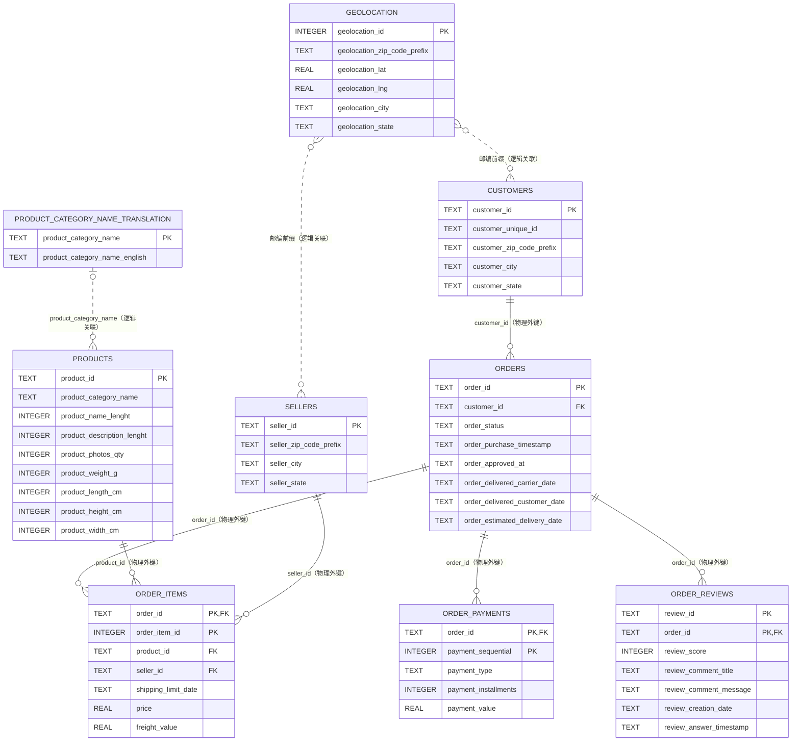

# 数据库表关系

### customers

- 表作用：保存订单级客户记录及客户所在地信息。
- 主键：`customer_id`。
- 外键：无。
- 表之间关系：通过 `customer_id` 与 `orders` 构成一对多物理关系；通过 `customer_zip_code_prefix` 与 `geolocation.geolocation_zip_code_prefix` 进行邮编前缀逻辑关联，不是物理外键。

### orders

- 表作用：保存订单状态及订单生命周期时间。
- 主键：`order_id`。
- 外键：`customer_id` → `customers.customer_id`。
- 表之间关系：属于一个 `customers` 客户记录；通过 `order_id` 分别与 `order_items`、`order_payments`、`order_reviews` 构成一对多物理关系。

### order_items

- 表作用：保存订单中的商品明细、卖家、价格和运费。
- 主键：联合主键 `(order_id, order_item_id)`。
- 外键：`order_id` → `orders.order_id`；`product_id` → `products.product_id`；`seller_id` → `sellers.seller_id`。
- 表之间关系：每条明细属于一个 `orders` 订单、一个 `products` 商品和一个 `sellers` 卖家。

### order_payments

- 表作用：保存订单的分次付款记录。
- 主键：联合主键 `(order_id, payment_sequential)`。
- 外键：`order_id` → `orders.order_id`。
- 表之间关系：多条付款记录可以属于同一个 `orders` 订单。

### order_reviews

- 表作用：保存订单评价分数、评价内容及评价时间。
- 主键：联合主键 `(review_id, order_id)`。
- 外键：`order_id` → `orders.order_id`。
- 表之间关系：多条评价记录可以属于同一个 `orders` 订单。

### products

- 表作用：保存商品分类、名称与描述长度、图片数量、重量和尺寸。
- 主键：`product_id`。
- 外键：无。
- 表之间关系：通过 `product_id` 与 `order_items` 构成一对多物理关系；通过 `product_category_name` 与 `product_category_name_translation.product_category_name` 进行逻辑关联，不是物理外键。

### sellers

- 表作用：保存卖家及卖家所在地信息。
- 主键：`seller_id`。
- 外键：无。
- 表之间关系：通过 `seller_id` 与 `order_items` 构成一对多物理关系；通过 `seller_zip_code_prefix` 与 `geolocation.geolocation_zip_code_prefix` 进行邮编前缀逻辑关联，不是物理外键。

### geolocation

- 表作用：保存邮编前缀对应的地理坐标、城市和州信息。
- 主键：`geolocation_id`，由 SQLite 在导入时生成。
- 外键：无。
- 表之间关系：通过 `geolocation_zip_code_prefix` 与 `customers.customer_zip_code_prefix`、`sellers.seller_zip_code_prefix` 进行邮编前缀逻辑关联；这些关系不是物理外键。

### product_category_name_translation

- 表作用：保存葡萄牙语商品分类名称与英文分类名称的对应关系。
- 主键：`product_category_name`。
- 外键：无。
- 表之间关系：通过 `product_category_name` 与 `products.product_category_name` 进行逻辑关联，不是物理外键。
