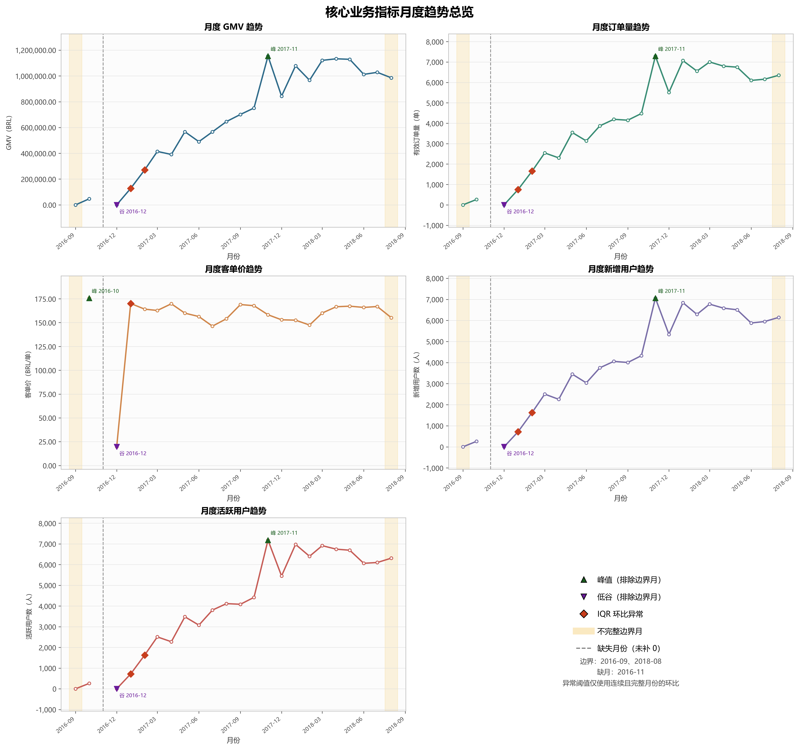

# 核心业务趋势分析

## 1. 数据范围与验证

- 数据源：`outputs/data/02_business_overview/monthly_kpi.csv`，并与 SQLite View `monthly_kpi` 逐值核对。
- 字段：`month`、`gmv`、`order_count`、`average_order_value`、`new_users`、`active_users`，与公共层字段完全一致。
- 覆盖范围：2016-09 至 2018-08，共 23 个观测月份；源文件按月升序，重复月份 0 个。
- 缺失月份：2016-11。未填充为 0，图中的折线在缺月处主动断开。
- 空值：`average_order_value` 1 个。该空值位于覆盖初期边界月，符合 GMV 为 0、无有效支付订单时 AOV 返回 NULL 的既有口径。
- CSV 与数据库 View：完全一致。

### 数据边界

2016-09 是业务数据覆盖初期，仅从月中开始；2018-08 是数据截止月，未覆盖完整自然月。两个月均保留在图中并以黄色背景标注，但不参与正常峰值、低谷、环比异常阈值和业务阶段判断。2016-11 在公共层中缺失，报告与图表均保留这一时间缺口，不补 0。新增用户是观察期内首次产生 delivered 订单的用户，覆盖开始前历史缺失可能导致早期存量用户被识别为新增用户。

## 2. 五项核心指标总体趋势

- **GMV：** 完整可比期由 46,566.71 BRL 增至 1,027,903.86 BRL（+2107.38%），峰值出现在 2017-11。
- **订单量：** 完整可比期由 265 单 增至 6,159 单（+2224.15%），峰值出现在 2017-11。
- **客单价：** 完整可比期由 175.72 BRL 变为 166.89 BRL（-5.02%）；2017-02 至 2018-07 主要落在 146.28—169.76 BRL/单，峰值出现在 2016-10。
- **新增用户：** 完整可比期由 262 人 增至 5,949 人（+2170.61%），峰值出现在 2017-11。
- **活跃用户：** 完整可比期由 262 人 增至 6,100 人（+2228.24%），峰值出现在 2017-11。

## 3. 业务阶段划分

阶段划分只使用 GMV、订单量、新增用户、活跃用户四项共同趋势，排除 2016-09 和 2018-08。方法是对四指标做 `log1p` 与标准化，对 1—4 个有序阶段进行动态规划（每段至少 3 个观测月），以段内平方误差最小并用 BIC 惩罚段数；BIC 越低越优。本次结果为：1 段=12.18；2 段=-56.53；3 段=-48.91；4 段=-35.96，自动选择 2 个阶段。缺失的 2016-11 不参与拟合，也未补值。

| 阶段 | 起止月份 | 观测月数 | 主要变化 | 共同趋势依据 |
|---|---|---:|---|---|
| 1：覆盖初期与波动期 | 2016-10—2017-01 | 3 | 四项规模指标处于低基数并剧烈波动；2016-12 同时触及四项规模指标低谷，随后在 2017-01 共同反弹。 | GMV 均值 58,044.00 BRL；订单量均值 339 单；新增/活跃用户均值 327/327 人 |
| 2：规模化增长期 | 2017-02—2018-07 | 18 | GMV、订单量、新增用户和活跃用户同步扩张，2017-11 共同达到峰值；2018 年上半年维持高位但月间有回落与修复。 | GMV 均值 792,384.19 BRL；订单量均值 4,951 单；新增/活跃用户均值 4,791/4,883 人 |

该结果没有强行增加更多阶段：在复杂度惩罚后，额外分段未带来足够的联合趋势解释增益。阶段 2 内部仍可观察到 2017-11 的共同峰值及 2018 年上半年的高位调整，但不足以被模型识别为独立阶段。

## 4. 峰值、低谷与异常月份

峰值和低谷仅在完整月份中选择，边界月即使数值更极端也不参与。

| 指标 | 峰值月份 | 峰值 | 低谷月份 | 低谷 |
|---|---|---:|---|---:|
| GMV | 2017-11 | 1,153,528.05 BRL | 2016-12 | 19.62 BRL |
| 订单量 | 2017-11 | 7,289 单 | 2016-12 | 1 单 |
| 客单价 | 2016-10 | 175.72 BRL | 2016-12 | 19.62 BRL |
| 新增用户 | 2017-11 | 7,060 人 | 2016-12 | 1 人 |
| 活跃用户 | 2017-11 | 7,183 人 | 2016-12 | 1 人 |

异常候选基于逐指标环比 IQR：低于 `Q1 - 1.5 × IQR` 或高于 `Q3 + 1.5 × IQR`。只有当前月与上一个观测月连续、且两者均不是边界月时，环比才进入阈值计算及异常判断。

| 指标 | IQR 下界 | IQR 上界 |
|---|---:|---:|
| GMV | -62.24% | 95.72% |
| 订单量 | -74.40% | 110.40% |
| 客单价 | -14.74% | 15.60% |
| 新增用户 | -74.52% | 109.63% |
| 活跃用户 | -74.08% | 109.21% |

识别到的异常月份如下：

| 月份 | 越界指标 | GMV 环比 | 订单量环比 | 客单价环比 | 新增用户环比 | 活跃用户环比 | 初步回查 |
|---|---|---:|---:|---:|---:|---:|---|
| 2017-01 | GMV、订单量、客单价、新增用户、活跃用户 | 649979.87% | 74900.00% | 766.77% | 71600.00% | 71700.00% | GMV 由订单量与客单价同向异常变化共同驱动（订单量贡献更大）；订单量环比 74900.00%，客单价环比 766.77%，新增用户环比 71600.00%，活跃用户环比 71700.00%。现有数据无法验证具体外部原因。 |
| 2017-02 | GMV、订单量、新增用户、活跃用户 | 112.71% | 120.40% | -3.49% | 127.06% | 127.02% | GMV 主要由订单量变化驱动，客单价影响较小；订单量环比 120.40%，客单价环比 -3.49%，新增用户环比 127.06%，活跃用户环比 127.02%。现有数据无法验证具体外部原因。 |

## 5. 异常月份回查

- **2017-01：** 前一观测月 2016-12 仅有 1 单、GMV 19.62 BRL、新增与活跃用户均为 1 人，形成极低比较基数。2017-01 订单量增至 750 单、客单价由 19.62 升至 170.06 BRL，GMV 的异常增长由订单量与客单价共同推动；新增与活跃用户也同步回升。现有数据无法验证 2016-12 极低值或 2017-01 反弹的具体外部原因。
- **2017-02：** GMV 环比增长 112.71%，订单量增长 120.40%，而客单价变化 -3.49%；因此 GMV 异常主要由订单量扩张驱动。新增与活跃用户分别增长 127.06% 和 127.02%，与订单扩张方向一致。现有数据无法验证具体外部原因。

完整逐月环比、阈值、异常标记及诊断见 `outputs/data/02_business_overview/monthly_trend_diagnostics.csv`。

## 6. 核心业务结论

1. 四项规模指标长期同向扩张：从首个完整月 2016-10 到末个完整月 2018-07，GMV、订单量、新增用户和活跃用户分别增长 2107.38%、2224.15%、2170.61% 和 2228.24%。
2. 2017-11 是明确的共同规模峰值：GMV 1,153,528.05 BRL、订单量 7,289 单、新增用户 7,060 人、活跃用户 7,183 人同时达峰，不是单一指标造成的假象。
3. GMV 的长期增长主要伴随订单和用户规模增长，而非持续抬升客单价：2017-02 至 2018-07 的客单价范围仅为 146.28—169.76 BRL/单，明显比同期规模指标的增幅平稳。
4. 2017-01 与 2017-02 是 IQR 规则识别出的异常月份。前者受 2016-12 极低基数及订单量、客单价共同反弹影响；后者主要由订单量和用户规模继续扩张驱动。两月的具体外部成因均无法由现有数据验证。
5. 2018-03 至 2018-07 处于高位波动区间：GMV 为 1,012,090.68—1,132,933.95 BRL，订单量为 6,099—7,003 单；2018-08 因截止期不完整，不应用于判断后续趋势。

---

生成说明：图表采用 `Microsoft YaHei` 字体、300 DPI PNG；金额保留两位小数，数量按整数展示。分析严格复用月度公共数据层，未改变指标定义或 SQL 口径。
