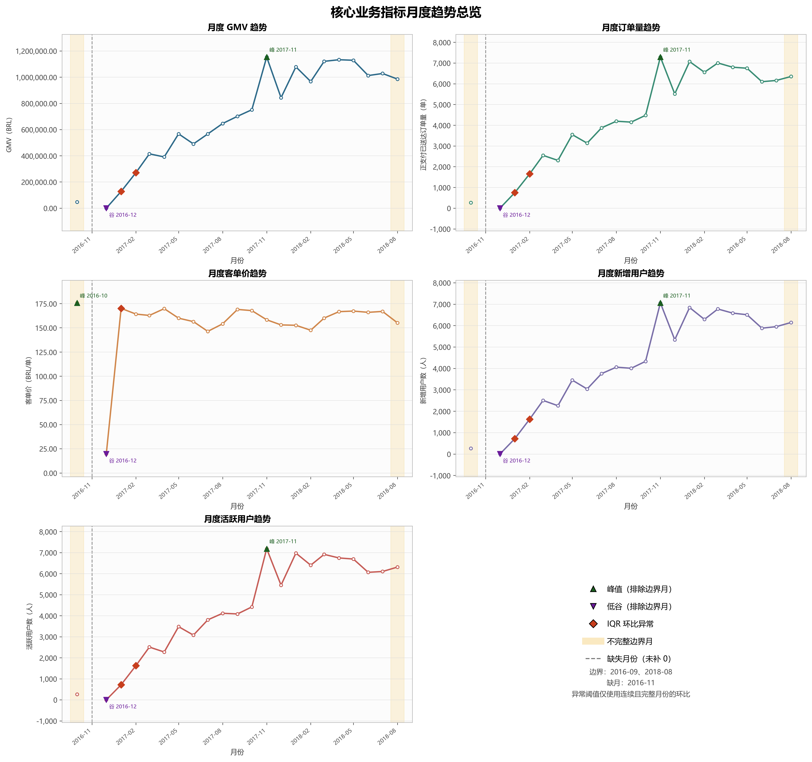
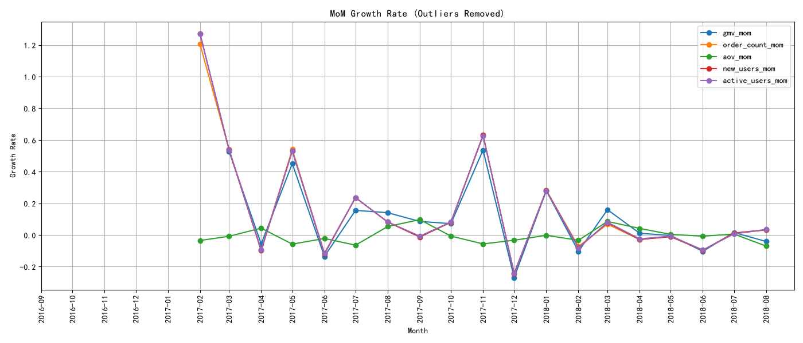
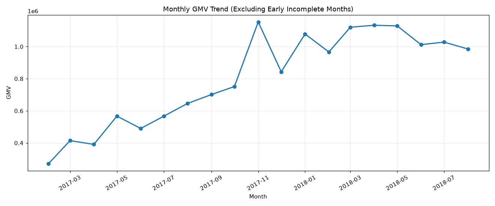
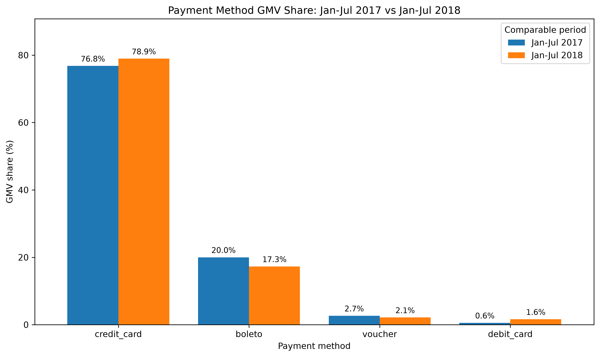
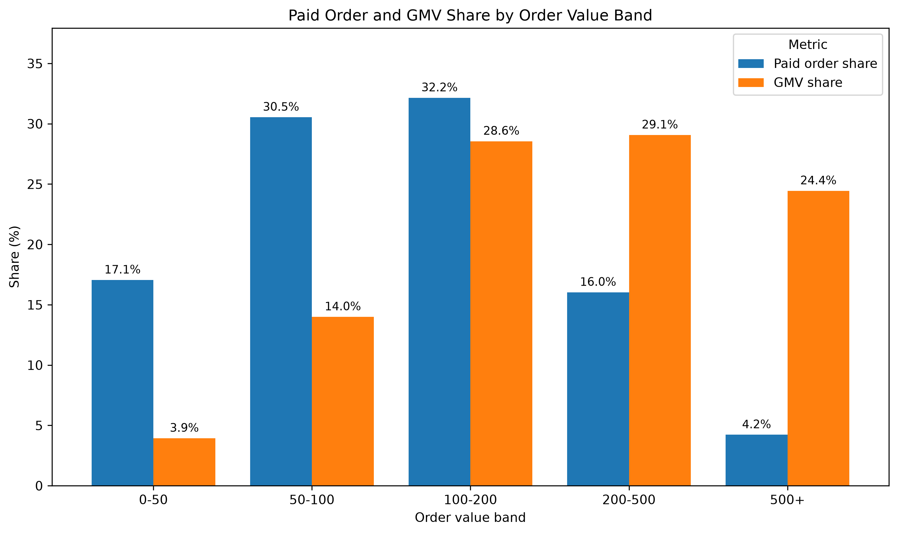
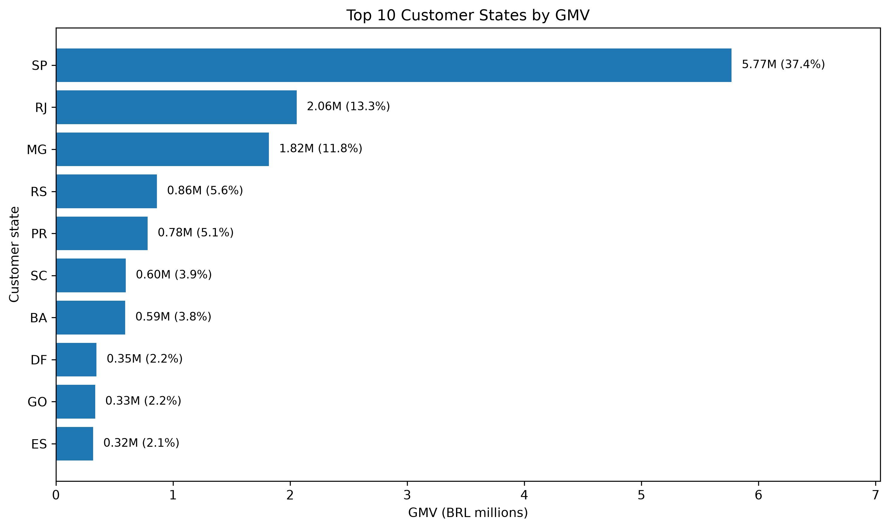

| 日期 | 修改人 | 版本号 | 备注 |
|---|---|---|---|
| 2026-08-10 | FL | v1.0 | 阶段二最终整合与质量控制 |
| 2026-08-12 | FL | v1.1 | 月度公共层统一为正支付 delivered 订单范围 |
| 2026-08-13 | Codex | v1.2 | 按最新成员报告、代码与 CSV 重写阶段二综合报告 |

# 阶段二：整体业务大盘诊断最终报告

## 摘要

本报告整合核心业务趋势、增长质量与节假日、支付/订单金额/州级结构以及策略情景。月度分析统一限定为订单级正支付且 `order_status = 'delivered'` 的订单；GMV 为正 `payment_value` 先按订单聚合后的总和，AOV 为 GMV 除以同范围支付订单数。

主要结论如下：

1. 从首个完整月 2016-10 到末个完整月 2018-07，GMV 从 46,566.71 增至 1,027,903.86 BRL，增长 2,107.38%；订单量增长 2,224.15%，AOV 反而下降 5.02%。规模扩张主要伴随订单和用户增长，而非 AOV 持续提升。
2. 2017-11 是完整观察期内的共同峰值，GMV、订单量、新增用户和活跃用户同时达到最高；2018-03 至 2018-07 保持高位波动。
3. 节日表现不一致。2017 Black Friday 当日日均 GMV 较节前提高 381.67%，由订单日均增长 469.29%推动，AOV 下降 15.39%；Carnival 和 Christmas 没有形成一致方向，不能认定稳定季节规律。
4. 全观察期 GMV 在信用卡、头部州和中高金额订单上集中：信用卡贡献 78.46%，SP/RJ/MG 合计贡献 62.54%，200 BRL及以上订单贡献 53.51%。
5. 策略应以实验验证为前提：优先测试加购和组合销售，其次增强支付渠道韧性，再对非头部州开展分层试点。情景测算是条件假设，不是经营预测。

## 1. 数据范围与指标口径

### 1.1 数据范围

- 数据源：SQLite View `monthly_kpi` 及 `outputs/data/02_business_overview/monthly_kpi.csv`。
- delivered 订单购买时间覆盖 2016-09-15 至 2018-08-29。
- 月度支付型公共层实际覆盖 2016-10 至 2018-08，共 22 个有记录月份。
- 2016-09 的唯一 delivered 订单没有正支付，不进入支付型月度层。
- 2016-11 没有 delivered 订单，保持缺口，不填 0。
- 2018-08 为不完整截止月，只展示，不参与正式峰谷、异常、阶段或完整月比较。

### 1.2 核心指标

| 指标 | 定义 |
|---|---|
| GMV | delivered 订单中，正 `payment_value` 按订单聚合后的总和 |
| 支付订单量 | 订单级正支付金额大于 0 的 delivered 去重订单数 |
| AOV | GMV / 支付订单量 |
| 新增用户 | 观察期内首次产生正支付 delivered 订单的 `customer_unique_id` |
| 活跃用户 | 当月至少产生 1 笔正支付 delivered 订单的唯一用户 |

结构分析的全观察期范围为 96,477 个正支付 delivered 订单、GMV 15,422,461.77 BRL。完整月份 2016-10—2018-07 合计 90,126 单、GMV 14,437,047.49 BRL。

## 2. 核心趋势

### 2.1 总体变化

| 指标 | 2016-10 | 2018-07 | 变化 |
|---|---:|---:|---:|
| GMV（BRL） | 46,566.71 | 1,027,903.86 | +2,107.38% |
| 支付订单量 | 265 | 6,159 | +2,224.15% |
| AOV（BRL/单） | 175.72 | 166.89 | -5.02% |
| 新增用户 | 262 | 5,949 | +2,170.61% |
| 活跃用户 | 262 | 6,100 | +2,228.24% |

2017-02 至 2018-07 的 AOV 主要处于 146.28—169.76 BRL/单，明显比规模指标稳定。因此 GMV 的长期扩张更接近订单和用户规模增长，而不是每单金额持续提高。

### 2.2 业务阶段

对 GMV、订单量、新增用户、活跃用户进行 `log1p`、标准化和有序动态规划后，BIC 在两段模型最低：1 段 12.18、2 段 -56.53、3 段 -48.91、4 段 -35.96。

| 阶段 | 时间 | 观测月数 | 特征 |
|---|---|---:|---|
| 覆盖初期与波动期 | 2016-10—2017-01 | 3 | 低基数、缺月和剧烈波动；2016-12仅1单，2017-01大幅反弹 |
| 规模化增长期 | 2017-02—2018-07 | 18 | 四项规模指标整体扩张，2017-11共同达峰，2018年上半年维持高位 |

模型没有为 2017-11 峰值或 2018 年高位调整单独增加阶段，说明额外分段的解释增益不足。

### 2.3 峰值与异常

完整月份内，GMV、订单量、新增用户和活跃用户均在 2017-11 达峰：

- GMV：1,153,528.05 BRL；
- 订单量：7,289 单；
- 新增用户：7,060 人；
- 活跃用户：7,183 人。

逐指标连续月份环比 IQR 仅识别出 2017-01 和 2017-02：

- 2017-01 GMV 环比 649,979.87%，主要因为 2016-12 只有 1 单、GMV 19.62 BRL，属于极低基数后的反弹。
- 2017-02 GMV 环比 112.71%、订单量环比 120.40%，AOV 环比 -3.49%，增长主要由订单量继续扩张伴随。

现有数据无法验证两个月波动对应的外部事件，不将其写成营销或市场原因。

## 3. 增长质量

### 3.1 增长驱动

`GMV = 支付订单量 × AOV`。观察期内多个月份 GMV 与订单量同向变化，而 AOV 波动较小。例如：

- 2017-02：GMV +112.71%，订单量 +120.40%，AOV -3.49%；
- 2017-11：GMV +53.57%，订单量 +62.77%，AOV -5.65%；
- 2018-03：GMV +15.95%，订单量 +6.83%，AOV +8.53%。

这说明增长通常由订单规模主导，AOV 在部分月份增强或抵消订单变化，但没有形成持续向上趋势。

### 3.2 稳定性

2018-03 至 2018-07：

- 月 GMV 为 1,012,090.68—1,132,933.95 BRL；
- 月订单量为 6,099—7,003 单；
- AOV 为 160.03—167.26 BRL。

平台进入较高规模区间，但仍存在月间回落和修复，不能把单月增长外推为稳定增速。2018-08 不完整，不参与后续趋势判断。

## 4. 节假日与季节性

### 4.1 比较方法

节日前、节中、节后窗口长度不同时，使用日均 GMV、日均订单量和 AOV 比较。只有窗口日期覆盖完整时才进行正式比较；2016 Black Friday 和 Christmas 因没有或只有少量观测日，不进入结论。

### 4.2 关键节日

| 节日 | 期间相对节前日均GMV | 日均订单量 | AOV | 节后表现 |
|---|---:|---:|---:|---|
| 2017 Carnival | -6.44% | -14.78% | +9.79% | 日均GMV +68.17%，订单 +52.60% |
| 2018 Carnival | -21.90% | -14.71% | -8.43% | 日均GMV +2.86%，订单 +7.31% |
| 2017 Black Friday | +381.67% | +469.29% | -15.39% | 日均GMV仍较节前 +42.33%，订单 +75.52% |
| 2017 Christmas | -42.22% | -35.58% | -10.30% | 日均GMV -23.53%，订单 -11.96% |

Black Friday 表现为强订单量事件，而非 AOV 上升；Carnival 两年方向和幅度不同；Christmas 当日和节后均弱于节前。当前可用节日样本有限，不能推断长期稳定季节性。

## 5. 业务结构

### 5.1 支付结构

混合支付订单按支付方式实际金额拆分 GMV；订单份额使用订单内金额最大的主支付方式稳定归属。

| 支付方式 | GMV（BRL） | GMV占比 | 主支付订单数 | 订单占比 |
|---|---:|---:|---:|---:|
| credit_card | 12,101,094.88 | 78.46% | 72,785 | 75.44% |
| boleto | 2,769,932.58 | 17.96% | 19,191 | 19.89% |
| voucher | 343,013.19 | 2.22% | 3,017 | 3.13% |
| debit_card | 208,421.12 | 1.35% | 1,484 | 1.54% |

2017-01—07 与 2018-01—07 同期比较中，信用卡 GMV 占比由 76.79%升至 78.94%，boleto 由 20.00%降至 17.29%。这说明支付结构进一步向信用卡集中，但缺少支付失败率、手续费和拒付数据，不能评价其净影响。

### 5.2 订单金额结构

| 订单金额区间 | 订单数 | 订单占比 | GMV（BRL） | GMV占比 |
|---|---:|---:|---:|---:|
| 0—50 | 16,451 | 17.05% | 606,653.04 | 3.93% |
| 50—100 | 29,466 | 30.54% | 2,159,145.09 | 14.00% |
| 100—200 | 31,018 | 32.15% | 4,403,742.50 | 28.55% |
| 200—500 | 15,466 | 16.03% | 4,483,233.00 | 29.07% |
| 500+ | 4,076 | 4.22% | 3,769,688.14 | 24.44% |

100—200 BRL 是订单数最大的核心区间。200 BRL及以上订单合计只占 20.26%，却贡献 53.51% GMV，显示收入对中高金额订单较敏感。GMV 贡献不等于利润贡献。

### 5.3 州级结构

| 州 | GMV（BRL） | GMV占比 |
|---|---:|---:|
| SP | 5,770,266.19 | 37.41% |
| RJ | 2,055,690.45 | 13.33% |
| MG | 1,819,277.61 | 11.80% |
| RS | 861,802.40 | 5.59% |
| PR | 781,919.55 | 5.07% |

前三州贡献 62.54%，前五州 73.20%，前十州 87.36%；GMV HHI 为 1,831.76。同期增长分类中，SP、MG、SC 属于高规模高增长，RJ、RS、PR、BA 为高规模低于平台增长，DF、ES 为低规模高增长候选。小州增速可能受低基数影响，不能直接认定为成熟机会。

## 6. 核心问题

1. **规模增长依赖订单和用户扩张。** AOV 未随规模长期提高，如果订单和获客增速下降，现有增长结构可能承压。
2. **支付渠道集中。** 78.46% GMV 来自信用卡，业务对单一支付方式的依赖较高，但尚无证据表明已经产生实际损失。
3. **区域集中。** 超过六成 GMV 来自 SP、RJ、MG，平台对少数核心州的需求变化较敏感。
4. **中高金额订单贡献集中。** 200 BRL以上订单贡献超过一半 GMV，需要关注该群体的需求与体验，但不能等同于高利润订单。

## 7. 策略与情景测算

所有情景均基于 2018-07 完整月：GMV 1,027,903.86 BRL、订单量 6,159、AOV 166.89 BRL。

### 7.1 优先级一：加购与组合销售

假设订单量不变，AOV 提升 2%/5%/8%，对应月度增量 GMV：

| 情景 | 新AOV | 增量GMV（BRL） | 总GMV（BRL） |
|---|---:|---:|---:|
| 保守 | 170.23 | 20,557.51 | 1,048,461.37 |
| 基准 | 175.23 | 51,393.78 | 1,079,297.64 |
| 乐观 | 180.24 | 82,230.04 | 1,110,133.90 |

实际执行必须监测转化率、优惠成本、退款和毛利；当前测算不包含这些因素。

### 7.2 优先级二：支付韧性

将总 GMV 的 1.0/2.5/4.0 个百分点从信用卡引导至其他支付方式，对应转移 10,279.04/25,697.60/41,116.15 BRL，信用卡占比降至约 77.46%/75.96%/74.46%。该策略目标是降低集中风险，转移额不计作新增 GMV。

### 7.3 优先级三：非头部州分层试点

假设非前三州目标池 GMV 提升 1.5%/3%/5%，对应增量 GMV 5,840.55/11,681.10/19,468.50 BRL。该测算用全样本州级结构近似 2018-07 结构，且未计营销和物流成本，只适合确定试点量级。

## 8. 综合建议

- 将订单量、AOV、新增/活跃用户联合监控，避免仅以 GMV 判断增长质量。
- 对 2017-11 等峰值继续拆解活动、品类与用户来源；在缺少外部事件数据时不作原因断言。
- 加购实验优先面向 100—200 BRL 核心订单区间，并设置转化率和净收益护栏。
- 建立支付成功率、手续费、失败恢复率监控后再评估渠道引导价值。
- 区域试点分开管理“大规模低增速州”和“小规模高增速州”，避免用同一策略处理。

## 9. 局限性

- 2016-09、2018-08 不完整，2016-11 缺月，早期趋势受覆盖不足影响。
- 新增用户是观察期内首笔正支付 delivered 订单，不是平台注册用户，存在左截尾。
- 数据没有访问、曝光、营销投入、商品成本、利润、退款、支付失败和完整物流成本。
- 节日样本年份少，部分窗口不完整，只能做描述性比较。
- 州级和支付结构差异不代表因果；策略结果是固定条件下的情景测算。

## 10. 结果追溯

| 模块 | 成员报告 | 主要代码/SQL | 主要 CSV |
|---|---|---|---|
| 核心趋势 | [business_trend_analysis.md](business_trend_analysis.md) | `00_monthly_kpi_view.sql`、`business_overview_trends.py` | `monthly_kpi.csv`、`monthly_trend_diagnostics.csv` |
| 增长/季节性 | [growth_quality_holiday_seasonality_analysis.md](growth_quality_holiday_seasonality_analysis.md) | `02_growth_quality.sql`、`03_seasonality_analysis.sql` 及 Python 脚本 | `monthly_growth_rates.csv`、`holiday_comparison.csv`、`daily_kpi.csv` |
| 业务结构 | [business_diagnosis_report.md](business_diagnosis_report.md) | `04_business_structure.sql`、`business_structure.py` | `payment_structure.csv`、`order_value_structure.csv`、`state_structure.csv` |
| 问题与策略 | [core_business_issues.md](core_business_issues.md)、[strategy_scenario_analysis.md](strategy_scenario_analysis.md) | `strategy_scenario_analysis.py` | `strategy_scenarios.csv` |

本报告中的关键数字已与当前 CSV 逐项核对；成员文字、旧图表或旧数字与当前公共层冲突时，以统一口径和当前可复现产物为准。
