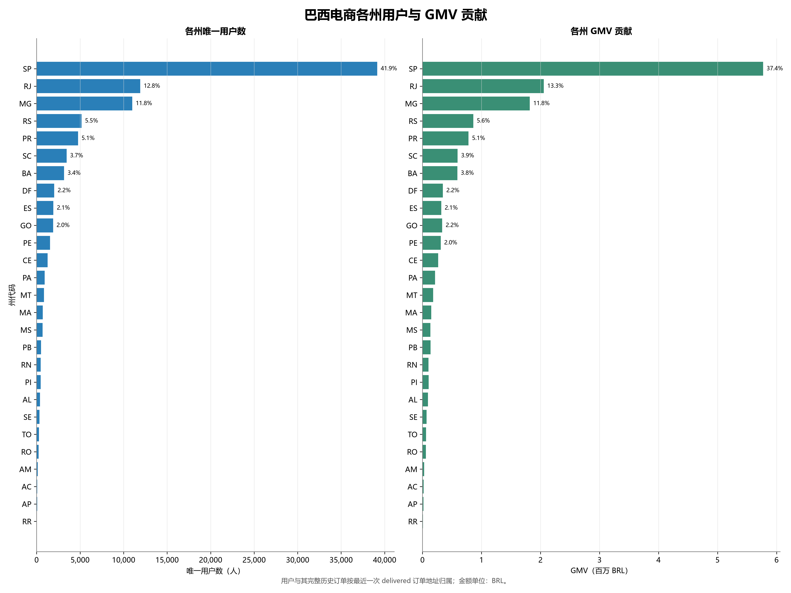
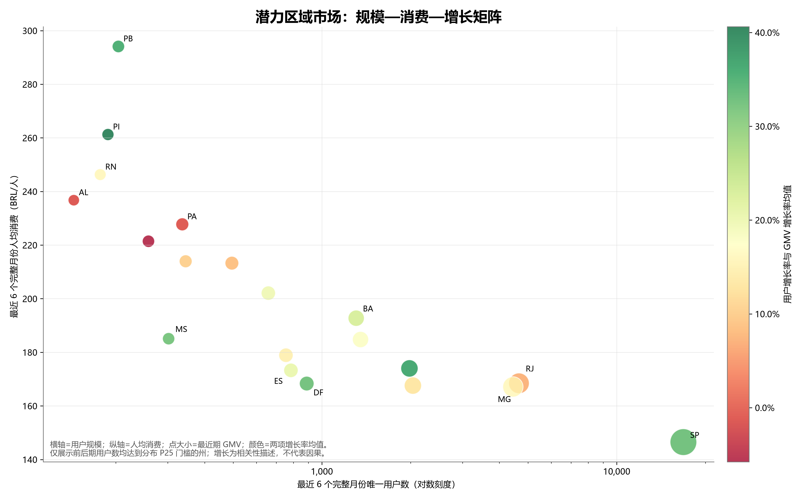
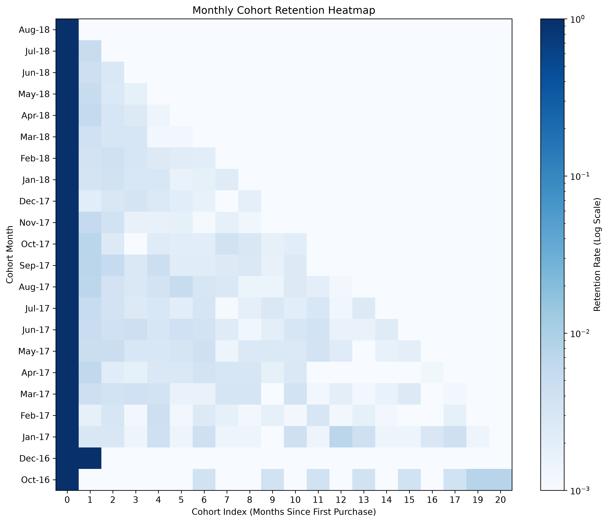
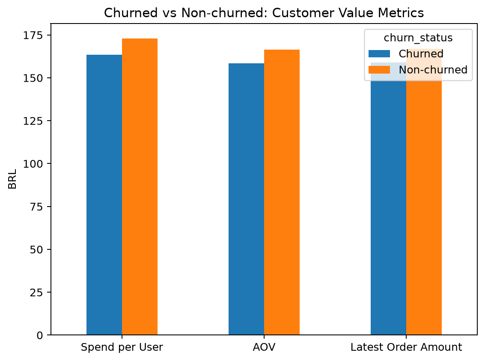
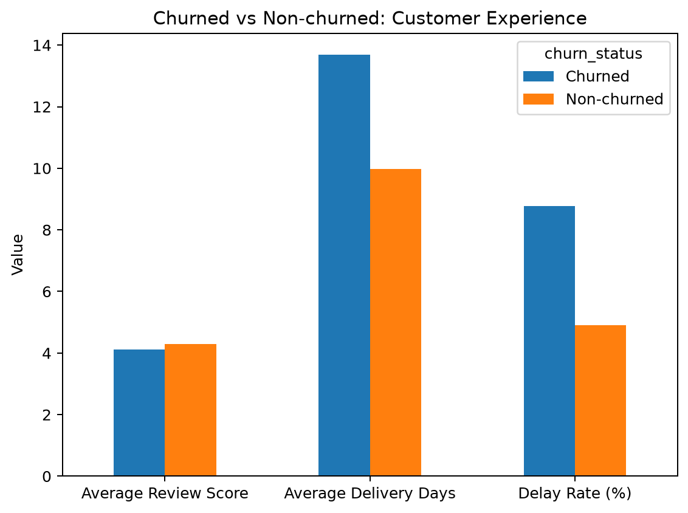

| 日期 | 修改人 | 版本号 | 备注 |
|---|---|---|---|
| 2026-08-11 | FL | v0.1 | 阶段三首次整合，标记 Member 2 时间口径待统一 |
| 2026-08-13 | FL | v0.2 | 按最新成员报告、SQL 与 CSV 重写，并复核观察窗口 |

# 阶段三：用户行为与价值分析综合报告

> **版本状态：有条件可用。** 用户画像、RFM、流失与高价值用户结果已经完成统一口径对账；Member 2 的短期复购和生命周期产物仍存在实现与固定截止日不完全一致的问题。本报告明确区分正式结果与待修正结果，不把待修正数字纳入最终业务判断。

## 摘要

阶段三从地域与购买时段、RFM 价值、Cohort/短期复购、生命周期、流失和高价值用户六个角度分析用户。正式跨成员分析统一使用 `customer_unique_id`、delivered 订单、订单购买时间及 2018-07-31 观察截止日。

主要结论如下：

1. 全观察期画像显示用户与 GMV 高度集中在 SP、RJ、MG，前三州分别贡献 66.47% 用户和 62.55% GMV；工作日日均订单量高于周末。
2. 截至 2018-07-31，正式 RFM 范围为 87,214 名用户、90,127 个 delivered 订单和 14,437,047.49 BRL GMV；整体复购率仅 3.01%。
3. 重要挽留用户占 23.38%，贡献 42.78% GMV，是优先验证召回策略的主要候选；重要发展用户占 16.61%，贡献 30.70% GMV，适合验证二购促进。
4. 按 `recency_days > 90` 定义，流失用户为 68,686 人，占 78.76%。流失用户平均配送时长更长、延迟率更高、平均评分更低，但这些是相关性，不能证明物流或评分导致流失。
5. 正式“重要价值用户”仅 4 人，其中流失 1 人。该分层受 Frequency 高分门槛和交易低频结构影响，只适合个案分析，不能外推为稳定群体画像。
6. Member 2 的月度 Cohort 显示跨月复购普遍很低，但当前短期复购 CSV 和生命周期 CSV 尚未完全按统一截止日重跑，相关数值暂不作为最终正式指标。

## 1. 数据范围与统一口径

| 项目 | 正式口径 |
|---|---|
| 用户 | `customer_unique_id` 去重 |
| 有效订单 | `order_status = 'delivered'` |
| 时间归属 | `order_purchase_timestamp` |
| 正式截止日 | 2018-07-31，订单时间 `< 2018-08-01 00:00:00` |
| GMV | 正 `payment_value` 先按订单聚合，再连接 delivered 订单 |
| AOV | GMV / 正支付 delivered 订单数 |
| 复购 | 同一窗口至少 2 笔去重有效订单 |
| 流失 | 截止日 `recency_days > 90` |
| 评论 | 一单一条代表评论 |

Member 1 的地域与时段画像使用全部观察期（截至 2018-08-29），用于描述数据全貌；RFM、流失、高价值交叉及正式生命周期比较必须使用 2018-07-31 截止口径。两种窗口不能直接合计或横向比较。

## 2. 用户画像与行为

### 2.1 全观察期基础规模

全观察期共有 96,478 个 delivered 订单、96,477 个正支付订单、93,358 名唯一用户，GMV 为 15,422,461.77 BRL。唯一无正支付的 delivered 订单保留在有效订单数中，不进入 AOV 分母。

### 2.2 地域集中

| 州 | 唯一用户 | 用户占比 | GMV（BRL） | GMV占比 | 人均消费（BRL） |
|---|---:|---:|---:|---:|---:|
| SP | 39,150 | 41.94% | 5,772,454.12 | 37.43% | 147.44 |
| RJ | 11,914 | 12.76% | 2,055,586.40 | 13.33% | 172.54 |
| MG | 10,995 | 11.78% | 1,818,932.65 | 11.79% | 165.43 |

前三州合计贡献 66.47% 用户和 62.55% GMV。SP 规模最大，但人均消费低于 RJ 和 MG。该差异不能直接解释为收入、价格或营销效果。

### 2.3 购买时段

- 订单峰值为 16 时：6,476 单，占 6.71%；GMV 峰值为 14 时：1,075,200.03 BRL，占 6.97%。
- Monday 订单最多：15,701 单，占 16.27%。
- 工作日共 74,288 单，占 77.00%；周末 22,190 单，占 23.00%。按自然日标准化后，工作日 145.66 单/日，周末 108.77 单/日。

因此工作日优势不仅来自一周中工作日天数更多，但数据没有访问、曝光或营销日历，无法解释原因。

### 2.4 潜力区域

最近 6 个完整月 2018-02—2018-07 与此前 6 个月 2017-08—2018-01 比较。20 个州达到前后期均至少 129 名用户的样本门槛。BA、DF、ES、MS 同时属于“中等规模且用户和 GMV 增长较快”；PB、PI 等表现为高人均、低渗透。RR 虽增速高，但前后期仅 7 人和 20 人，被小样本门槛排除。

这些标签只用于筛选后续验证对象，不代表已证明市场潜力。

## 3. RFM 用户价值

### 3.1 正式范围与结果

截至 2018-07-31，RFM 覆盖 87,214 名用户、90,127 个有效订单、90,126 个正支付订单和 14,437,047.49 BRL GMV；复购用户 2,621 人，复购率 3.01%。

| 层级 | 用户数 | 用户占比 | GMV（BRL） | GMV占比 | 人均消费 | 复购率 | 平均 Recency |
|---|---:|---:|---:|---:|---:|---:|---:|
| 重要价值 | 4 | 0.00% | 3,763.98 | 0.03% | 941.00 | 100.00% | 63.75 |
| 重要发展 | 14,482 | 16.61% | 4,432,602.53 | 30.70% | 306.08 | 6.54% | 84.07 |
| 重要保持 | 1 | 0.00% | 959.01 | 0.01% | 959.01 | 100.00% | 167.00 |
| 重要挽留 | 20,391 | 23.38% | 6,176,160.10 | 42.78% | 302.89 | 5.55% | 316.32 |
| 一般用户 | 52,336 | 60.01% | 3,823,561.87 | 26.48% | 73.06 | 1.03% | 227.35 |

重要挽留和重要发展用户合计占 39.99%，贡献 73.48% GMV，是比“重要价值用户”更具规模意义的运营候选群体。

### 3.2 解释边界

Frequency 只有 9 个不同取值且高度集中在 1，F 高分对应频次 7、9、12，导致重要价值和重要保持用户仅 4 人和 1 人。这是规则与数据分布共同形成的结果，不应为了扩大样本而临时修改分类。

## 4. Cohort、短期复购与生命周期

### 4.1 月度 Cohort

`cohort_monthly_retention.csv` 显示，多数 Cohort 在首购月后的跨月留存处于约 0.1%—1%量级，未呈现稳定改善趋势。该结果支持“跨月复购稀少”的描述，但早期队列样本很小，例如 2016-12 Cohort 仅 1 人，不能据此比较留存质量。

### 4.2 当前短期复购产物的问题

现有 `short_term_repeat_retention.csv` 报告 7/30/90 日复购率分别为 0.89%、1.42%、2.38%，分母分别为 85,622、81,418、69,405 名具备完整观察窗口的用户。

但 SQL 复核发现两个问题：

1. 订单序列没有先限制为 `order_purchase_timestamp < 2018-08-01`；
2. 复购分子没有同步限制为具备对应完整观察窗口的首购用户。

按统一截止日和同分母资格只读回算，复购人数应分别为 735、1,072、1,417，对应约 0.86%、1.32%、2.04%。这些回算值尚未写回正式 SQL/CSV，因此本报告不把旧 CSV 或临时回算值作为最终发布指标；待 Member 2 修正脚本并重跑后再定版。

### 4.3 当前生命周期产物的问题

`customer_lifecycle_segment.csv` 和 `lifecycle_stage_comparison.csv` 当前覆盖全期 93,358 名用户，GMV 15,422,461.77 BRL；生命周期 SQL 还使用 `MAX(last_purchase_timestamp)` 和 `2018-09-03` 计算 Recency。它们与阶段三固定截止日下的 87,214 名用户和 14,437,047.49 BRL 不一致。

因此当前“休眠用户 80.23%”等生命周期数字只记录为待修正产物，不进入本报告正式综合结论，也不与 Member 3 的流失分类直接比较。

## 5. 流失用户分析

### 5.1 流失规模

截至 2018-07-31：

| 指标 | 流失用户 | 未流失用户 |
|---|---:|---:|
| 用户数 | 68,686 | 18,528 |
| 用户占比 | 78.76% | 21.24% |
| GMV（BRL） | 11,232,309.18 | 3,204,738.31 |
| 人均消费（BRL） | 163.53 | 172.97 |
| 复购率 | 2.88% | 3.47% |
| 平均评分 | 4.106 | 4.287 |
| 平均配送天数 | 13.69 | 9.98 |
| 延迟率 | 8.78% | 4.91% |

流失用户在人均消费、复购、评分和配送体验上均弱于未流失用户。不过支付结构、地域、工作日/周末与流失的关联强度较弱：主支付方式 Cramér's V 为 0.0526，州为 0.0476，工作日/周末仅 0.0098。

不能据此写成“配送延迟导致流失”。近期 Cohort 的用户还没有完整 90 天观察机会，首购月份与流失率的直接比较存在右截尾。

## 6. 高价值用户与流失交叉

正式重要价值用户仅 4 人：3 人为成熟用户、1 人为休眠用户；其中高价值流失用户仅 1 人。4 人共有 35 单、GMV 3,763.98 BRL，购买频次为 7—12 次。

唯一高价值流失个案位于 SP/Praia Grande，Frequency 为 9、Monetary 为 1,172.66 BRL、Recency 为 154 天，平均评分 2.78、平均配送时长 14.13 天、延迟率 11.11%。这些特征只能描述该个体，不能推广为高价值用户流失的一般原因。

## 7. 综合业务判断

1. 用户规模与 GMV 集中在少数州，区域运营应兼顾 SP 等核心市场和具备样本基础的中等规模增长州。
2. 用户交易频率整体很低，正式窗口复购率仅 3.01%。增长不能只依赖不断获得新客，应优先对重要发展用户验证二购促进，对重要挽留用户验证召回。
3. 流失用户与未流失用户在配送、延迟和评分上存在差异，值得在阶段五继续做订单级相关分析，但当前证据不支持因果结论。
4. RFM 的极小高价值样本不适合直接制定规模化专属策略；更有业务规模的对象是重要发展和重要挽留用户。
5. Member 2 的正式价值在于补充复购时间结构，但必须先完成截止日、分子分母资格和生命周期重跑，才能与 RFM、流失模块合并发布。

## 8. 建议

- 对重要发展用户开展首购后分时二购实验，以增量复购率和净 GMV 衡量，而不是仅看触达后购买率。
- 对重要挽留用户按历史品类、金额和 Recency 分层召回，并保留对照组。
- 对物流体验较差且历史价值较高的用户建立优先复核清单，先验证相关性是否在控制地区、品类和订单金额后仍存在。
- 区域扩张优先选择达到样本门槛的州；对 RR 等小样本高增速州不直接下结论。

## 9. 局限性与待办

- 观察期开始前历史不可见，首次购买和 Frequency 可能被低估。
- 2018-07-31 后的订单主动排除，近期用户必须控制完整观察窗口。
- 数据没有注册、访问、营销触达、成本和利润，不能计算真实获客、留存实验或利润效果。
- Member 2 需修正短期复购 SQL，并基于截止日前订单重建生命周期明细和汇总；完成前，本报告保持“有条件可用”。

## 10. 结果追溯

| 模块 | 报告 | 主要产物 |
|---|---|---|
| 用户画像 | [customer_analysis_report.md](customer_analysis_report.md) | `customer_profile.csv`、地域/时段/潜力市场 CSV |
| RFM | [rfm_customer_value_report.md](rfm_customer_value_report.md) | `rfm_customer_detail.csv`、`rfm_segment_summary.csv`、验证文件 |
| Cohort/生命周期 | [customer_lifecycle_cohort_analysis.md](customer_lifecycle_cohort_analysis.md) | Cohort、短期复购和生命周期 CSV；其中后两类待修正 |
| 流失/高价值 | [churn_user_analysis_report.md](churn_user_analysis_report.md) | `churn_comparison.csv`、特征、交叉及高价值画像 CSV |

本报告已核对成员报告、SQL、Python 脚本与当前 CSV；若成员文字与正式产物冲突，以统一口径和经验证的当前产物为准。
