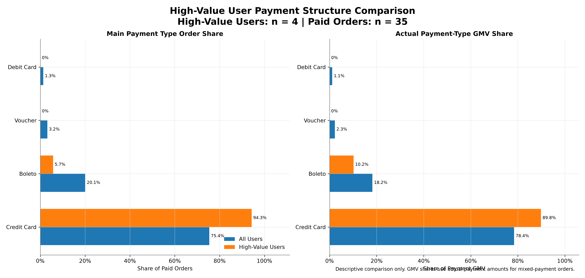
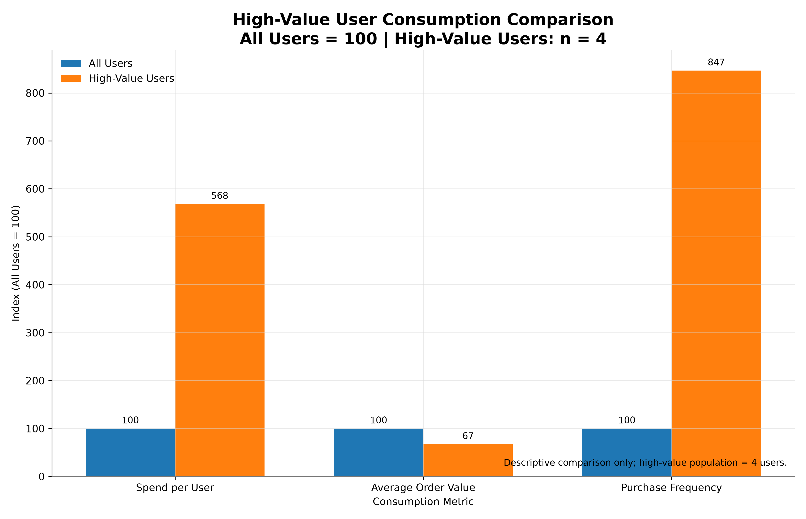
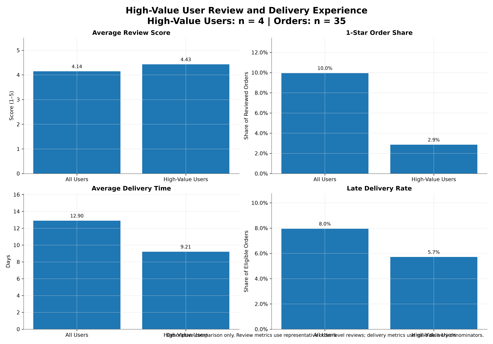

<!--
Version Record
- Stage: Phase 3 / Member 3
- Report: Churn User Analysis and High-Value User Profile
- Observation cutoff: 2018-07-31
- Official customer key: customer_unique_id
- Valid orders: delivered orders purchased before 2018-08-01 00:00:00
-->`n# 阶段三 Member 3：流失用户分析与高价值用户画像报告

本报告基于阶段三统一分析口径，对流失用户特征、重要价值用户画像以及
RFM × Churn × Lifecycle 交叉结果进行汇总。

报告中的流失为固定观察窗口下的**行为型流失**，不代表用户永久离开。
所有画像及组间差异均属于描述性分析，不作直接因果推断。
`n## 1. 分析目标

本报告主要完成以下分析目标：

- 汇总正式观察窗口下的流失用户规模与结构；
- 对比流失与未流失用户的核心行为特征；
- 描述重要价值用户的地域、支付、消费及评论配送体验；
- 联合 RFM、Churn 与 Lifecycle 进行交叉分析；
- 对高价值流失用户进行个案级综合描述；
- 明确小样本、观察窗口和非因果解释边界。
`n## 2. 数据范围与统一口径

### 2.1 数据范围

本报告严格遵循 `docs/unified_analysis_standards.md`。

正式用户唯一标识为 `customer_unique_id`；仅纳入
`order_status = delivered` 且
`order_purchase_timestamp < 2018-08-01 00:00:00`
的有效订单。

固定观察截止日为 **2018-07-31**。

GMV 仅统计正 `payment_value`；AOV 使用
**GMV / 正支付订单量**，而不是除以全部 delivered 订单量。
存在支付信息异常但符合 delivered 有效订单口径的订单时，不因此删除有效订单。

### 2.2 流失规则

用户最近一次有效购买距离观察截止日：

- `recency_days > 90`：流失用户；
- `recency_days <= 90`：未流失用户。

该定义表示固定窗口下的行为型流失状态，不等价于永久客户流失。

### 2.3 重要价值用户规则

重要价值用户严格定义为：

`R >= 4 AND F >= 4 AND M >= 4`

分析过程中不因样本量较小而调整 RFM 或 churn 阈值。

### 2.4 生命周期交叉口径

Member 3 正式生命周期交叉使用
`member3_lifecycle_bridge.csv`，不直接使用观察窗口不同的原 Member 2
`customer_lifecycle_segment.csv`。

正式生命周期规则首先判断 `recency > 90` 为 Dormant Customer，
再对未流失用户依据订单数、recency 与 lifecycle_days
划分 New、Early、Growing 和 Mature Customer。
`n## 3. 流失用户分析

### 3.1 总体流失规模

| Metric | Churned | Non-churned |
|---|---|---|
| Users | 68,686 | 18,528 |
| User Share | 78.76% | 21.24% |
| Spend per User (BRL) | 163.53 | 172.97 |
| Average Purchase Frequency | 1.0317 | 1.0398 |
| Repeat Rate | 2.88% | 3.47% |
| Average Lifecycle Days | 1.85 | 4.86 |
| Average Order Value (BRL) | 158.51 | 166.35 |
| Average Review Score | 4.106 | 4.287 |
| Average Delivery Days | 13.69 | 9.98 |
| Late Delivery Rate | 8.78% | 4.91% |

### 3.2 流失与未流失用户核心指标

| Feature | Type | Churned | Non-churned | Difference | Interpretation | Limitation |
|---|---|---|---|---|---|---|
| Spend per User | Continuous | 163.5300 | 172.9700 | -9.4400 | Churned users show lower spend per user. | Descriptive difference only; no causal claim. |
| Average Purchase Frequency | Continuous | 1.0317 | 1.0398 | -0.0081 | Purchase frequency is slightly lower among churned users. | Observed difference is small. |
| Repeat Rate | Percentage | 2.8800 | 3.4700 | -0.5900 | Churned users have a lower repeat-purchase rate. | Descriptive association only. |
| Average Lifecycle Days | Continuous | 1.8500 | 4.8600 | -3.0100 | Churned users show shorter observed purchase lifecycles. | Lifecycle is strongly related to sparse repeat purchasing. |
| Average Order Value | BRL | 158.5100 | 166.3500 | -7.8400 | Churned users have lower AOV. | Descriptive difference only. |
| Latest Order Amount | BRL | 158.9600 | 166.9600 | -8.0000 | The latest order amount is lower among churned users. | Descriptive difference only. |
| Average Review Score | Score 1-5 | 4.1060 | 4.2870 | -0.1810 | Churned users have lower average review scores. | Only orders with valid representative review scores are included. |
| Average Delivery Days | Days | 13.6900 | 9.9800 | 3.7100 | Churned users experienced longer average delivery times. | Only orders with valid delivery timestamps are included. |
| Delay Rate | Percentage | 8.7800 | 4.9100 | 3.8700 | Churned users show a higher delayed-delivery rate. | Association does not establish that delay causes churn. |
| Primary Payment Type | Categorical | NULL | NULL | NULL | Payment structure differs slightly, but overall association is weak. | Mixed-payment orders use the unified primary-payment rule. |
| Customer State | Categorical | NULL | NULL | NULL | Some states differ in churn rate, but overall state association is weak. | Large absolute churn counts may simply reflect market size. |
| Weekday / Weekend | Categorical | NULL | NULL | NULL | Weekday/weekend purchase structure has almost no association with churn. | Calendar-day counts include zero-order dates. |
| First Purchase Month | Time Structure | NULL | NULL | NULL | Recent cohorts cannot be directly compared with older cohorts on churn rate. | 2018-05 has only 244/6506 users with full 90-day opportunity; 2018-06 and 2018-07 have none. |

以上结果用于描述正式观察窗口内两类用户的行为差异。
这些差异可能与客户活跃程度和历史购买行为相关，但不能据此推断因果关系。

### 3.3 流失相关特征

流失相关特征分析基于统一用户粒度和固定观察截止日完成。
对于不同特征组之间观察到的差异，本报告仅进行描述性解释。

### 3.4 地域结构

| State | Users | Churned Users | Non-churned Users | Churn Rate | User Share |
|---|---|---|---|---|---|
| SP | 36,089 | 27,704 | 8,385 | 76.77% | 41.38% |
| RJ | 11,220 | 9,058 | 2,162 | 80.73% | 12.86% |
| MG | 10,314 | 8,268 | 2,046 | 80.16% | 11.83% |
| RS | 4,887 | 3,956 | 931 | 80.95% | 5.60% |
| PR | 4,452 | 3,546 | 906 | 79.65% | 5.10% |
| SC | 3,256 | 2,641 | 615 | 81.11% | 3.73% |
| BA | 2,999 | 2,343 | 656 | 78.13% | 3.44% |
| DF | 1,875 | 1,437 | 438 | 76.64% | 2.15% |
| ES | 1,828 | 1,458 | 370 | 79.76% | 2.10% |
| GO | 1,780 | 1,441 | 339 | 80.96% | 2.04% |

地域分布用于展示当前样本结构，不意味着特定州本身造成更高或更低的流失风险。

### 3.5 支付方式结构

| Group | Primary Payment Type | Orders | Order Share | Users |
|---|---|---|---|---|
| Churned | credit_card | 53,291 | 75.20% | 51,751 |
| Churned | boleto | 14,493 | 20.45% | 14,135 |
| Churned | voucher | 2,329 | 3.29% | 2,269 |
| Churned | debit_card | 748 | 1.06% | 741 |
| Non-churned | credit_card | 14,682 | 76.21% | 14,158 |
| Non-churned | boleto | 3,579 | 18.58% | 3,491 |
| Non-churned | voucher | 538 | 2.79% | 529 |
| Non-churned | debit_card | 466 | 2.42% | 461 |

支付方式结构同样属于观察性结果。混合支付及订单级主支付方式均按照
Member 3 已锁定的支付口径处理，避免一张订单被重复计入多个主支付方式。

### 3.6 首购时间解释

首购月份结构用于辅助理解用户进入平台的时间差异。
由于较早进入平台的用户拥有更长的可观察历史，因此首购时间与当前流失状态之间
可能同时受到观察窗口长度影响，不能将首购月份直接解释为流失原因。
`n## 4. 重要价值用户总体情况

正式 RFM 结果中，重要价值用户共 **4 人**，
其中高价值流失用户 **1 人**。

由于重要价值用户总体样本仅为 **4 人**，
后续地域、支付、消费、体验及生命周期画像均只代表该小样本中的观察结果，
不能推广为全部高价值客户群体的稳定规律。
`n## 5. 重要价值用户地域画像

重要价值用户仅 **4 人**，因此本节地域结果仅用于描述
当前正式高价值样本的实际分布，不将样本分布推广为整体市场结构。

### 5.1 州级分布

| State | High-Value Users | High-Value Churn Users | GMV (BRL) |
|---|---|---|---|
| SP | 3 | 1 | 2,641.26 |
| PE | 1 | 0 | 1,122.72 |

州级结果反映当前样本中重要价值用户及其累计消费的分布情况。
由于样本量很小，不据此判断某一州是高价值用户的稳定“核心市场”。

### 5.2 用户所在城市

| State | City | Orders | GMV (BRL) | Lifecycle Stage | Churn |
|---|---|---|---|---|---|
| PE | recife | 7 | 1,122.72 | Mature Customer | 0 |
| SP | praia grande | 9 | 1,172.66 | Dormant Customer | 1 |
| SP | santos | 7 | 758.83 | Mature Customer | 0 |
| SP | sao paulo | 12 | 709.77 | Mature Customer | 0 |

城市级结果用于展示这组重要价值用户的实际所在地，
不进行城市间高价值用户总体占比或流失风险的统计推广。
`n## 6. 重要价值用户支付画像

重要价值用户支付结构继续采用阶段三锁定口径。
订单支付方式占比使用 `main_payment_type`，保证一张订单只归属一个主支付方式；
支付方式 GMV 占比则使用原始正 `payment_value` 按实际 `payment_type` 拆分，
避免将混合支付订单的全部 GMV 错误归入单一支付方式。

### 6.1 主支付方式订单占比

| Group | Main Payment Type | Orders | Order Share |
|---|---|---|---|
| all_users | boleto | 18,072 | 20.05% |
| all_users | credit_card | 67,973 | 75.42% |
| all_users | debit_card | 1,214 | 1.35% |
| all_users | voucher | 2,867 | 3.18% |
| high_value_users | boleto | 2 | 5.71% |
| high_value_users | credit_card | 33 | 94.29% |

### 6.2 实际支付方式 GMV 占比

| Group | Payment Type | Payment GMV (BRL) | GMV Share |
|---|---|---|---|
| all_users | boleto | 2,629,123.86 | 18.21% |
| all_users | credit_card | 11,319,158.63 | 78.40% |
| all_users | debit_card | 163,030.60 | 1.13% |
| all_users | voucher | 325,734.40 | 2.26% |
| high_value_users | boleto | 383.27 | 10.18% |
| high_value_users | credit_card | 3,380.71 | 89.82% |

以上支付特征仅描述当前 **4 位**重要价值用户样本，
不能据此推断某种支付方式会导致更高客户价值或更低流失风险。
`n## 7. 重要价值用户消费画像

| Group | Users | Valid Orders | Paid Orders | GMV (BRL) | Spend per User (BRL) | Average Order Value (BRL) | Purchase Frequency | Repeat Rate | High-Amount Order Share |
|---|---|---|---|---|---|---|---|---|---|
| all_users | 87,214 | 90,127 | 90,126 | 14,437,047.49 | 165.54 | 160.19 | 1.0334 | 3.01% | 4.25% |
| high_value_users | 4 | 35 | 35 | 3,763.98 | 941.00 | 107.54 | 8.7500 | 100.00% | 0.00% |

高金额订单继续严格定义为 `order_gmv >= 500 BRL`，
即统一金额档 `[500,+inf)`，不使用此前讨论过的 200 BRL 阈值。

消费画像用于区分购买频次、累计消费、订单金额结构和购买时间特征。
当前重要价值样本仅 **4 人**，
因此相关差异只作描述性解释，不作为总体高价值客户行为规律。
`n## 8. 评论与配送体验画像

| Group | Reviewed Orders | Average Review Score | 1-Star Order Share | Positive Review Rate | Delivery Orders | Average Delivery Days | Late Delivery Rate |
|---|---|---|---|---|---|---|---|
| all_users | 89,502 | 4.145 | 9.95% | 78.61% | 90,119 | 12.90 | 7.95% |
| high_value_users | 35 | 4.429 | 2.86% | 77.14% | 35 | 9.21 | 5.71% |

评论指标仅使用 1～5 分的合法代表评分；一订单多评论时按照已锁定规则选择唯一代表评论。
低评分订单统一定义为代表评分等于 1 的订单，不能用 `1 - 好评率` 替代。

配送时长仅纳入购买时间与实际送达时间合法且配送时长非负的订单；
延迟订单定义为实际送达时间晚于预计送达时间。

体验差异同样属于观察性描述。即使高价值用户或高价值流失个案表现出
评分、配送时长或延迟率差异，也不能直接解释为导致流失的因果因素。
`n## 9. RFM × Churn × Lifecycle 交叉

| Lifecycle Stage | High-Value Users | High-Value Churn Users | Orders | GMV (BRL) | Average Recency Days | Average Lifecycle Days | High-Value User Share |
|---|---|---|---|---|---|---|---|
| Dormant Customer | 1 | 1 | 9 | 1,172.66 | 154.00 | 162.00 | 25.00% |
| Mature Customer | 3 | 0 | 26 | 2,591.32 | 33.67 | 305.67 | 75.00% |

生命周期交叉统一使用 `member3_lifecycle_bridge.csv`，
其观察截止日、有效订单范围、用户粒度与 Member 3 正式分析保持一致。

正式对账已经验证：

- RFM Frequency 与生命周期有效订单数一致；
- RFM Monetary 与生命周期累计 GMV 一致；
- Recency 与固定观察截止日口径一致；
- Churn 用户与 Dormant Customer 完全一致。

重要价值用户仅 **4 人**，
因此生命周期分布只能描述该正式样本，不应据此估计稳定的高价值客户生命周期结构。
`n## 10. 高价值流失用户综合个案

正式高价值流失用户共 **1 人**。

| Metric | Value |
|---|---|
| Customer | 3e43e6105506432c953e165fb2acf44c |
| State / City | SP / praia grande |
| Lifecycle Stage | Dormant Customer |
| Recency Days | 154 |
| Frequency | 9 |
| Monetary (BRL) | 1,172.66 |
| R Score | 4 |
| F Score | 4 |
| M Score | 5 |
| Dominant Payment Type | credit_card |
| Average Order Value (BRL) | 130.30 |
| Average Review Score | 2.778 |
| Average Delivery Days | 14.13 |
| Late Delivery Rate | 11.11% |
| Weekday Order Share | 100.00% |
| Peak Purchase Hour | 10:00 |

该个案综合了地域、RFM、生命周期、支付、消费以及评论配送体验信息。

对于该高价值流失个体，可以描述其在评分、配送时长等维度表现出的特征，
并将其作为后续客户运营或进一步研究的关注对象。

但由于高价值流失样本仅 **1 人**，
不能将个体体验特征推广为高价值客户流失的一般规律，
更不能将配送、评分、支付方式等观察性差异解释为直接流失原因。
`n## 11. 核心结论

1. 正式分析严格基于固定观察窗口、`customer_unique_id` 用户粒度以及 delivered 有效订单口径，
   流失状态表示行为型流失，不代表用户永久离开。

2. 流失与未流失用户在消费、购买频次、生命周期及体验等维度存在可观察差异，
   这些结果用于用户结构描述和运营线索识别，不作因果解释。

3. 正式重要价值用户仅 **4 人**，
   其中高价值流失用户 **1 人**。
   因此高价值画像首先是小样本事实描述，而不是总体参数估计。

4. 当前高价值样本的价值特征更明显来自较高购买频次与累计消费，
   而不是依靠 `order_gmv >= 500 BRL` 的单笔高金额订单。

5. 当前高价值样本在地域、支付方式、评论和配送体验上均呈现一定集中或差异，
   但受样本量限制，只能表述为“本样本中”的观察结果。

6. RFM、Churn 与 Lifecycle 已通过统一口径桥接和跨模块对账，
   正式生命周期分析使用 `member3_lifecycle_bridge.csv`，
   不直接使用观察窗口不同的原 Member 2 生命周期文件。
`n## 12. 数据限制与解释边界

本报告正式用户总体为 **87,214 人**，
但重要价值用户只有 **4 人**，
高价值流失用户只有 **1 人**。

因此需要遵守以下解释边界：

- churn 是固定观察窗口下的行为型流失，不等于永久离开；
- 所有组间差异均来自观察性数据，只能描述相关、差异或可能的解释线索；
- 不根据观察性结果直接推断因果关系；
- 不为了增加高价值样本而修改 RFM 或 churn 阈值；
- 地域、支付、消费和体验画像均需明确小样本限制；
- 高价值流失分析属于个案级描述，不能推广为群体稳定规律；
- 合法高金额订单应保留，高金额本身不等于异常；
- delivered 有效订单不能因为缺少正支付 GMV 而被删除；
- 跨模块一对多数据必须先处理到订单级再进行 JOIN，避免订单数和 GMV 重复放大。
`n## 13. 正式产物与复现

### 13.1 核心数据产物

Member 3 正式数据产物位于：

`outputs/data/03_customer_analysis/`

核心文件包括：

- `churn_user_detail.csv`
- `churn_comparison.csv`
- `churn_related_features.csv`
- `churn_state_structure.csv`
- `churn_payment_structure.csv`
- `churn_first_purchase_month.csv`
- `member3_user_value_base.csv`
- `member3_order_payment_base.csv`
- `member3_order_experience_base.csv`
- `member3_lifecycle_bridge.csv`
- `high_value_user_integrated_profile.csv`
- `high_value_churn_user_integrated_profile.csv`

### 13.2 正式图表

正式高价值图表位于：

`visualizations/customer/high_value/`

包括：

- `high_value_consumption_comparison.png`
- `high_value_payment_comparison.png`
- `high_value_experience_comparison.png`

### 13.3 关键脚本

核心分析与复现脚本位于：

`src/analysis/customer_analysis/`

包括流失分析、正式用户基础表、支付基础表、体验基础表、
生命周期 bridge、高价值综合画像、正式可视化以及本报告生成脚本。

本报告由：

`member3_final_report.py`

根据正式 CSV 动态生成。

### 13.4 跨成员输入

RFM 正式输入继续使用统一口径下的 `rfm_customer_detail.csv`。

生命周期交叉不直接采用观察窗口不同的原 Member 2
`customer_lifecycle_segment.csv`，而使用重新按 Member 3 正式截止日构建的
`member3_lifecycle_bridge.csv`。

原 Member 1 和 Member 2 报告保持不修改。
`n## 14. 结语

Member 3 已完成流失用户分析、重要价值用户四类画像、
RFM × Churn × Lifecycle 交叉以及高价值流失用户综合个案分析。

最终结果应被理解为统一观察窗口下的正式描述性分析。
其中高价值用户和高价值流失用户样本尤其有限，
因此报告坚持以数据事实、口径一致性和解释边界为优先，
不通过调整阈值扩大样本，也不将观察性差异包装为因果结论。`n