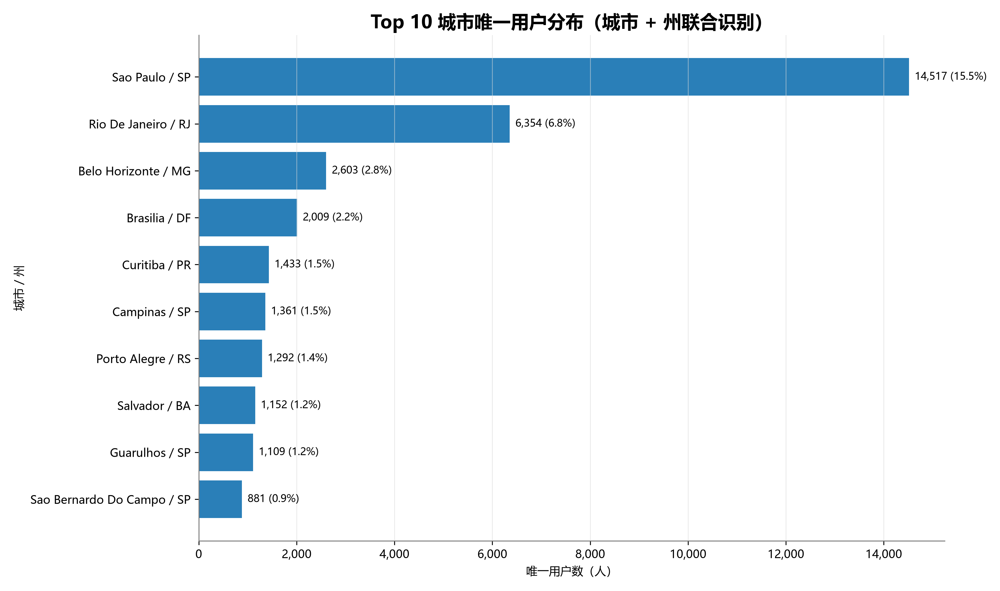
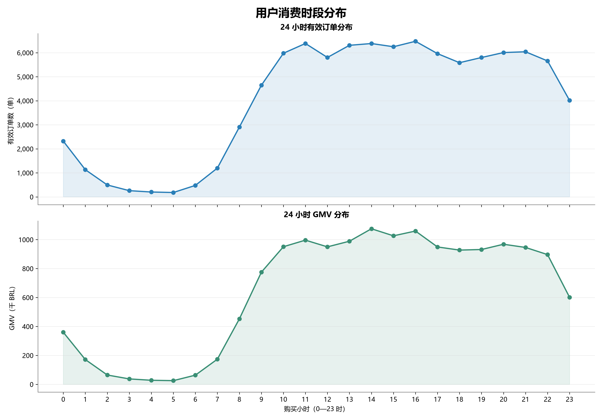
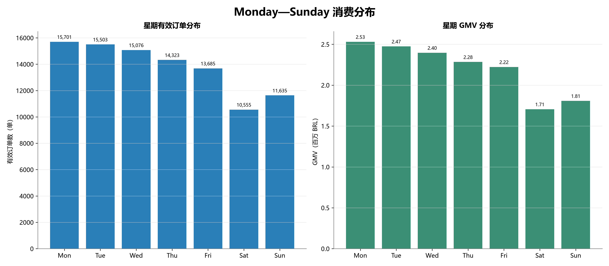

# 用户画像与行为分析报告（阶段三 Member 1）

## 1. 分析目标

建立可供 Member 2、Member 3 复用的订单级与用户级公共数据层，刻画用户地域、购买时段和区域市场差异，并用透明的规模—消费—增长规则识别“潜力区域市场”。本报告不使用“下沉市场”标签，因为数据没有城市等级、人口、收入或行政层级字段。

## 2. 数据范围与统一口径

- 数据库：`database/brazil_ecommerce.db`；购买时间覆盖 2016-09-15 12:16:38 至 2018-08-29 15:00:37。
- 有效订单：`order_status = 'delivered'`，共 96,478 单；其中正支付订单 96,477 单。
- 唯一用户：`customer_unique_id`，共 93,358 人；不得用 `customer_id` 替代。
- GMV：正 `payment_value` 先按 `order_id` 聚合，再连接 delivered 订单，总计 15,422,461.77 BRL。唯一无正支付的 delivered 订单保留在订单数中，`order_gmv` 记 0，但不进入客单价分母。
- 客单价：GMV / 正支付 delivered 订单数；与正式指标字典一致，不使用全部 delivered 订单数作分母。
- 数据边界：2016-09 与 2018-08 为不完整首尾月；增长分析排除这两个边界月。

## 3. 公共表粒度与地域规则

- `customer_order_base`：一行一个 delivered `order_id`，保留订单发生时的用户州、市、购买时间、订单 GMV 和是否正支付。
- `customer_profile`：一行一个 `customer_unique_id`，包含首购、最近购买、有效/支付订单数、累计 GMV、客单价、生命周期天数、活跃购买月数、复购标记和代表地域。
- 代表地域：取用户最近一次 delivered 订单对应的客户地址；若购买时间相同，依次按 `order_id DESC`、`customer_id DESC` 确定，保证结果可重复。
- 州/城市画像把用户完整观察期订单与 GMV归属到该代表地域，因此每名用户只进入一个州和一个“城市 + 州”组合，汇总后可与用户公共表严格对账。增长分析则使用每笔订单当时的地址，以反映两个时期真实发生的区域交易。

## 4. 用户地域分布结果

### 4.1 州级 Top 5

| 州 | 唯一用户数 | 用户占比 | GMV（BRL） | GMV 占比 | 人均消费（BRL/人） |
|---|---:|---:|---:|---:|---:|
| SP | 39,150 | 41.94% | 5,772,454.12 | 37.43% | 147.44 |
| RJ | 11,914 | 12.76% | 2,055,586.40 | 13.33% | 172.54 |
| MG | 10,995 | 11.78% | 1,818,932.65 | 11.79% | 165.43 |
| RS | 5,167 | 5.53% | 861,886.46 | 5.59% | 166.81 |
| PR | 4,766 | 5.11% | 780,868.38 | 5.06% | 163.84 |

**数据事实：** SP 用户与 GMV 均排名第 1，贡献 39,150 人（41.94%）和 5,772,454.12 BRL（37.43%）。RJ、MG 分别位列第 2、3；前三州合计贡献 66.47% 用户和 62.55% GMV。

**基于数据的解释：** 用户和 GMV 均明显集中在 SP、RJ、MG，核心市场识别来自客观排名，而非事前指定。

### 4.2 城市级 Top 10（城市 + 州）

| 城市 / 州 | 唯一用户数 | 用户占比 | GMV（BRL） | GMV 占比 |
|---|---:|---:|---:|---:|
| Sao Paulo / SP | 14,517 | 15.55% | 2,109,190.02 | 13.68% |
| Rio De Janeiro / RJ | 6,354 | 6.81% | 1,111,157.35 | 7.20% |
| Belo Horizonte / MG | 2,603 | 2.79% | 405,862.54 | 2.63% |
| Brasilia / DF | 2,009 | 2.15% | 344,271.80 | 2.23% |
| Curitiba / PR | 1,433 | 1.53% | 238,636.06 | 1.55% |
| Campinas / SP | 1,361 | 1.46% | 208,760.94 | 1.35% |
| Porto Alegre / RS | 1,292 | 1.38% | 214,861.83 | 1.39% |
| Salvador / BA | 1,152 | 1.23% | 207,567.42 | 1.35% |
| Guarulhos / SP | 1,109 | 1.19% | 157,647.38 | 1.02% |
| Sao Bernardo Do Campo / SP | 881 | 0.94% | 116,785.21 | 0.76% |

São Paulo / SP 贡献 14,517 人（15.55%）与 2,109,190.02 BRL（13.68%）；Rio de Janeiro / RJ 贡献 6,354 人（6.81%）与 1,111,157.35 BRL（7.20%）。城市始终与州联合识别，避免跨州同名城市被错误合并。

## 5. 消费时段结果

- **数据事实—小时：** 订单峰值为 16 时，共 6,476 单（6.71%）；GMV 峰值为 14 时，共 1,075,200.03 BRL（6.97%）。0—23 时均在输出中保留。
- **数据事实—星期：** Monday 订单最多，为 15,701 单（16.27%）。输出按 Monday 至 Sunday 排序，并保留星期序号。
- **数据事实—工作日/周末：** 工作日合计 74,288 单（77.00%），周末 22,190 单（23.00%）；按观察区间内自然日标准化后，工作日 145.66 单/日、周末 108.77 单/日，周末约为工作日的 74.68%。
- **基于数据的解释：** 工作日总量优势并非完全来自 5 天对 2 天的天数差异；日均指标仍显示工作日更高。
- **尚未验证的原因假设：** 工作日白天/晚间的使用场景、营销触达节奏或履约承诺可能影响下单时段，但数据没有访问、曝光、活动或用户职业字段，不能验证原因。

## 6. 核心市场贡献

- SP + RJ 合计贡献 54.70% 用户、50.76% GMV；MG 是数据中实际排名第 3 的市场，贡献 11.78% 用户、11.79% GMV。
- SP 人均消费 147.44 BRL/人，低于 RJ 的 172.54 和 MG 的 165.43 BRL/人。该差异是观察期关联，不足以说明地区收入、价格或营销导致了差异。

## 7. 潜力区域市场识别方法与结果

增长窗口采用最近 6 个完整月份 2018-02—2018-07，对比此前 6 个完整月份 2017-08—2018-01。两期连续且等长，排除了不完整首尾月。

样本门槛完全由数据分布确定：分别取 27 州前期、近期正样本用户数的第 25 百分位并向上取整，即前后期均至少 129 人与 129 人；20 州满足门槛，7 州只保留原始指标、不作潜力判断。分母为 0 的增长率保持 `NULL`。本分析不建立主观综合评分，而采用公开阈值的多标签筛选；同一州可以属于多个类型。

- **规模较大但人均消费较低：** SP（16,833 人，人均 146.50 BRL，用户/GMV 增长 31.4%/34.0%）、RJ（4,660 人，人均 168.44 BRL，用户/GMV 增长 8.9%/5.3%）、MG（4,446 人，人均 167.10 BRL，用户/GMV 增长 15.8%/16.6%）、RS（2,035 人，人均 167.58 BRL，用户/GMV 增长 11.3%/14.7%）、PR（1,981 人，人均 173.99 BRL，用户/GMV 增长 27.0%/45.7%）、SC（1,352 人，人均 184.76 BRL，用户/GMV 增长 8.9%/27.1%）、DF（888 人，人均 168.34 BRL，用户/GMV 增长 31.4%/33.7%）、ES（785 人，人均 173.26 BRL，用户/GMV 增长 14.4%/26.5%）、GO（755 人，人均 178.91 BRL，用户/GMV 增长 10.4%/19.1%）
- **当前规模中等但增长较快：** BA（1,307 人，人均 192.73 BRL，用户/GMV 增长 17.9%/27.9%）、DF（888 人，人均 168.34 BRL，用户/GMV 增长 31.4%/33.7%）、ES（785 人，人均 173.26 BRL，用户/GMV 增长 14.4%/26.5%）、MS（302 人，人均 185.07 BRL，用户/GMV 增长 32.5%/31.8%）
- **人均消费较高但渗透规模较小：** PA（336 人，人均 227.75 BRL，用户/GMV 增长 -1.5%/-0.7%）、PB（204 人，人均 294.10 BRL，用户/GMV 增长 26.7%/44.2%）、PI（188 人，人均 261.25 BRL，用户/GMV 增长 16.0%/65.2%）、RN（177 人，人均 246.30 BRL，用户/GMV 增长 1.1%/30.8%）、AL（144 人，人均 236.74 BRL，用户/GMV 增长 5.9%/-8.7%）

其中“规模较大”=合格州近期用户数不低于中位数；“人均消费较低”=低于合格州中位数；“中等规模”=合格州近期用户数 P25—P75；“增长较快”=用户增长率和 GMV 增长率均不低于合格州各自中位数；“人均消费较高”=不低于合格州 P75，且用户占比低于合格州中位数。完整阈值已逐行写入 `potential_regional_markets.csv`。

**数据事实：** RR 的用户/GMV 增长率很高，但前期仅 7 人、近期仅 20 人，因此被样本门槛排除，避免把小基数波动误报为潜力。

**基于数据的解释：** 中等规模且两项增长均高于合格市场中位数的州适合进入下一轮验证；高人均、低渗透州可能存在扩量空间，但并不等于已证明可增长。

**尚未验证的原因假设：** 地区增长可能与品类偏好、物流改善、营销投放或支付结构有关。现有结果仅反映历史相关性，必须结合成本、利润、人口、触达和实验数据验证，不能作因果结论。

## 8. 业务问题与可验证假设

1. **事实：** 核心市场高度集中，且 SP 人均消费低于 RJ/MG。**假设：** SP 的订单结构或品类组合更偏低客单；可按州比较品类、订单金额带和复购率验证。
2. **事实：** 工作日日均订单高于周末。**假设：** 营销触达或使用场景造成差异；需接入曝光、访问、活动日历并做分时实验验证。
3. **事实：** 部分中等规模市场同时出现用户和 GMV 增长。**假设：** 这些市场具备增量投放效率；需结合 CAC、利润、物流时效和小范围增量实验验证。

## 9. 数据限制

- 数据只有交易成功后的订单、支付和客户地址，没有人口、收入、城市层级、流量、注册、营销成本或利润，因此不能定义“下沉市场”、渗透率或获客效率。
- `customer_unique_id` 的首次购买是观察期内首购，不代表平台注册或历史首次购买；生命周期受左右截尾影响。
- 代表地域采用最近订单地址，会把用户完整历史归到最新地址；适合一人一地画像，但不等同于订单发生时地域。订单级公共层保留原始订单地址供其他分析使用。
- 工作日/周末日均按首末订单日期之间的自然日计算；2016 年早期缺月可能压低整体日均，因此该指标适合相对比较，不宜解释为完整平台运营日均。
- 增长率不等于因果效果；样本门槛只能降低、不能消除小样本波动。

## 10. Member 2、Member 3 使用说明

- 生命周期、留存、RFM 和用户价值分析优先使用数据库表 `customer_profile` 或导出 `outputs/data/03_customer_analysis/customer_profile.csv`。主键为 `customer_unique_id`；关键字段为 `first_purchase_timestamp`、`last_purchase_timestamp`、`valid_order_count`、`paid_order_count`、`lifetime_gmv`、`average_order_value`、`customer_lifecycle_days`、`latest_purchase_month`、`customer_state`、`customer_city`。
- 需要订单序列、消费时段、复购间隔或按订单发生地分析时，使用数据库表 `customer_order_base` 或导出 `customer_order_base.csv`。主键为 `order_id`；`order_gmv` 已按订单聚合，禁止再次直接连接支付明细后求和。
- 若 Member 2/3 需要重新归属地域，应明确与本报告“最近一次有效订单地址”规则的差异，并重新做用户数与 GMV 对账。

---

生成说明：所有 CSV 使用 UTF-8 BOM；图表从最终 CSV 重新读取后生成，采用 `Microsoft YaHei` 字体和 300 DPI PNG。验证明细见 `outputs/data/03_customer_analysis/customer_analysis_validation.csv`。
