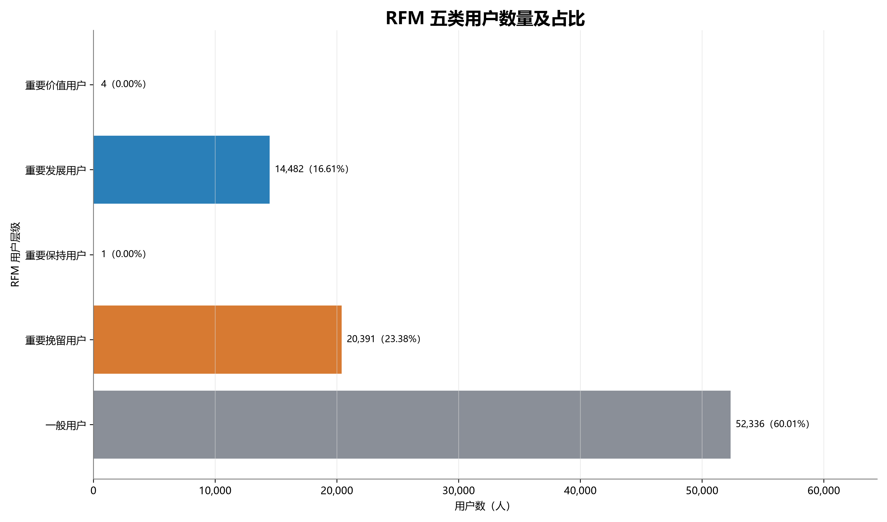
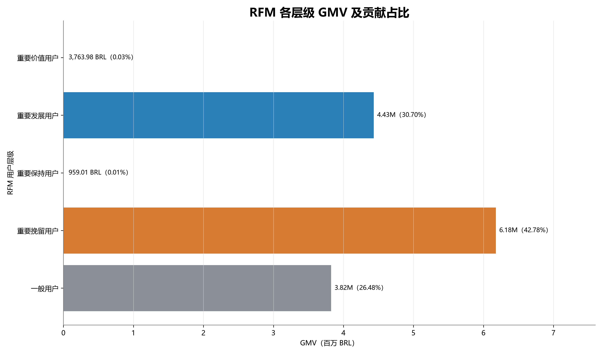
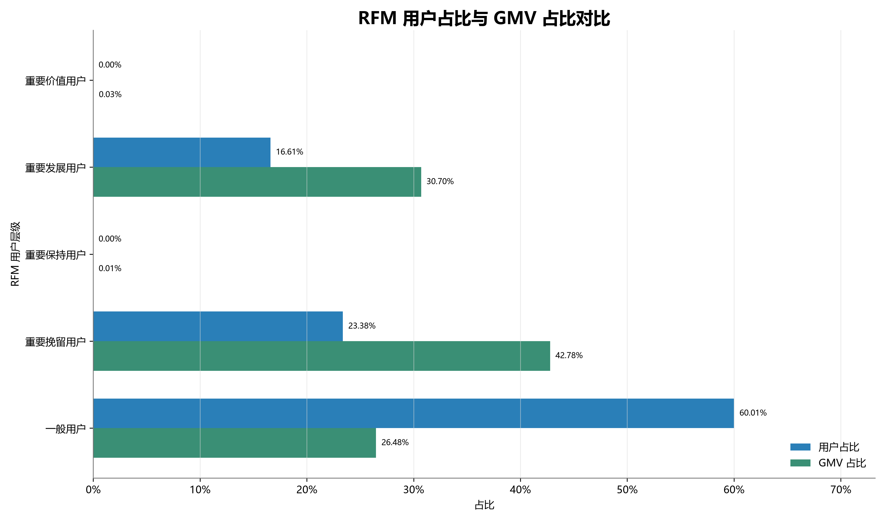
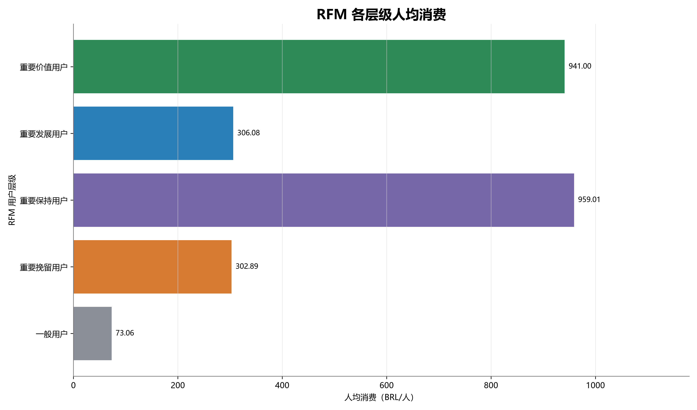
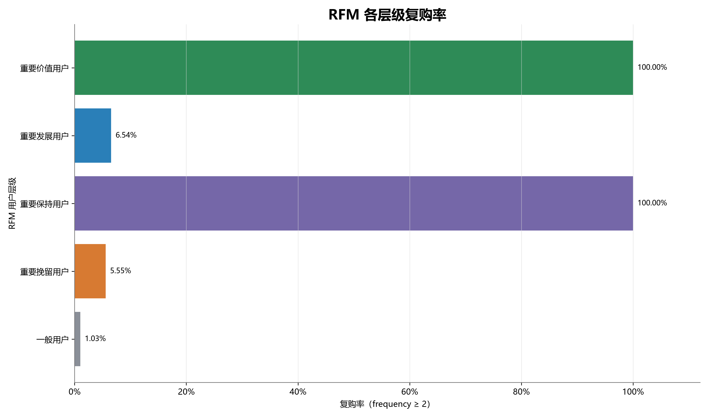

# RFM 用户价值分析报告

## 1. 分析目标

以固定观察截止日为基准，建立一行一个 `customer_unique_id` 的 RFM 明细，严格执行同值同分和五类互斥规则，量化各层级的用户、订单、GMV、消费和复购差异，并向 Member 3 提供可直接使用的用户分层文件。

## 2. 数据来源与统一口径

- 公共层：`customer_order_base`，一行一个 delivered 订单；`order_gmv` 已聚合到订单级。
- 观察截止日：`2018-07-31`；最后一笔纳入订单时间不晚于该日期。
- RFM 范围：87,214 名用户、90,127 个有效订单、14,437,047.49 BRL。
- 用户标识：`customer_unique_id`；Monetary 为截止日内 `SUM(order_gmv)`。
- 复购：`frequency >= 2`；整体复购用户 2,621 人，复购率 3.01%。
- 地域：截止日前最近 delivered 订单地址，时间相同按 `order_id DESC`、`customer_id DESC` 稳定选择。

`customer_profile` 的全期指标包含 2018-08，不能直接用于本次 2018-07-31 截止口径；本分析从订单级公共层按截止日重新汇总，没有重新连接原始支付或商品明细。

## 3. RFM 计算与评分方法

- Recency：截止日距离最近购买日期的天数，范围 0—684 天。
- Frequency：累计 delivered 订单数，范围 1—12。
- Monetary：累计订单级支付金额，范围 0.00—13,664.08 BRL。
- R 分位边界：P20=86、P40=163、P60=247、P80=363 天；越近分数越高。
- M 分位边界：P20=55.27、P40=87.55、P60=133.05、P80=208.99 BRL；金额越高分数越高。
- R/M 使用经验最近秩分位点并保持同值同分。F 只对不同取值执行五档划分。

### Frequency 与 F 分数映射

| Frequency | F 分数 |
|---:|---:|
| 1 | 1 |
| 2 | 1 |
| 3 | 2 |
| 4 | 2 |
| 5 | 3 |
| 6 | 3 |
| 7 | 4 |
| 9 | 4 |
| 12 | 5 |

## 4. 五类用户分类规则

| 顺序 | 类别 | 规则 |
|---:|---|---|
| 1 | 重要价值用户 | R>=4、F>=4、M>=4 |
| 2 | 重要发展用户 | R>=4、F<=3、M>=4 |
| 3 | 重要保持用户 | R<=3、F>=4、M>=4 |
| 4 | 重要挽留用户 | R<=3、F<=3、M>=4 |
| 5 | 一般用户 | M<=3，不论R/F |

规则依次判断，验证确认每名用户有且只有一个层级。

## 5. 各层级价值贡献

| 用户层级 | 用户数 | 用户占比 | 有效订单数 | GMV（BRL） | GMV占比 | 人均消费 | 客单价 | 复购率 | 平均Recency |
|---|---:|---:|---:|---:|---:|---:|---:|---:|---:|
| 重要价值用户 | 4 | 0.00% | 35 | 3,763.98 | 0.03% | 941.00 | 107.54 | 100.00% | 63.75 |
| 重要发展用户 | 14,482 | 16.61% | 15,568 | 4,432,602.53 | 30.70% | 306.08 | 284.73 | 6.54% | 84.07 |
| 重要保持用户 | 1 | 0.00% | 7 | 959.01 | 0.01% | 959.01 | 137.00 | 100.00% | 167.00 |
| 重要挽留用户 | 20,391 | 23.38% | 21,626 | 6,176,160.10 | 42.78% | 302.89 | 285.59 | 5.55% | 316.32 |
| 一般用户 | 52,336 | 60.01% | 52,891 | 3,823,561.87 | 26.48% | 73.06 | 72.29 | 1.03% | 227.35 |

## 6. 关键业务发现

1. **数据事实：** 重要挽留用户占 23.38%，贡献 42.78% GMV，是五类中 GMV 贡献最高的层级；其平均 Recency 为 316.32 天、人均消费 302.89 BRL。**基于数据的解释：** 该层级历史价值较高但最近购买较远，是优先验证召回策略的人群。
2. **数据事实：** 重要发展用户占 16.61%，贡献 30.70% GMV，人均消费 306.08 BRL、复购率 6.54%。**基于数据的解释：** 其近期性和金额较高但 F 较低，可作为第二次购买促进实验的候选人群。
3. **数据事实：** 一般用户占 60.01%，GMV贡献 26.48%，人均消费 73.06 BRL、复购率 1.03%。该层级规模大但单用户历史价值较低。
4. **数据事实：** 重要价值用户仅 4 人，重要保持用户仅 1 人。原因是 F>=4 仅覆盖 frequency 7、9、12；不是数据缺失，也没有为了扩大高价值样本而改变评分规则。
5. **关联描述：** 高 M 层级的人均消费显著高于一般用户，但 RFM 本身不能证明营销、地区或品类导致了这些差异。

## 7. 可执行运营建议

1. 对重要挽留用户设计分层召回试验，按最近品类和历史金额设置不同触达内容；以增量复购率、净 GMV 和毛利为评估指标，并保留对照组。
2. 对重要发展用户测试首购后限时二购提醒、关联品类推荐或服务提醒；当前分析只支持确定候选人群，不能预判促销必然有效。
3. 对一般用户先按首购金额、品类和物流体验继续拆分，避免对 60% 用户统一补贴；优先验证可识别的高意向子群。
4. 重要价值/保持用户样本仅 4/1 人，建议作为个案核查而非规模化策略依据；后续可对比其他 F 评分方案做敏感性分析，但必须保留本版规则作为基准。

## 8. 口径差异与限制

- 项目正式 AOV 口径为 GMV / 正支付 delivered 订单数，报告和 `average_order_value` 沿用正式口径；附件给出的 GMV / 全部有效订单数另存为 `gmv_per_valid_order`。截止日前仅 1 个有效订单无正支付。
- 观察期开始前历史不可见，Frequency 和首次购买日期可能被低估；截止日后交易被主动排除。
- F 的不同取值只有 9 个且极度集中，导致 F 高分样本很少；不应将 4—5 个用户外推为稳定群体画像。
- R/M 分位档保持同值同分，因此档位人数允许不完全均匀。
- 数据没有成本、利润、营销触达和实验结果，运营建议均需实验验证，不能作因果结论。
- 项目未找到附件提及的 `阶段三分工.md`；本次按附件中完整 Member 1 要求实施。

## 9. 验证结果与交付

- 严格验证共 29 项，全部通过；包括唯一性、无空值、同值同分、互斥分类、订单/GMV/复购对账、固定截止日和未来订单排除。
- Member 3 应直接使用 `outputs/data/03_customer_analysis/rfm_customer_detail.csv`。
- 完整规则见 `docs/rfm_scoring_rules.md`，验证明细见 `outputs/data/03_customer_analysis/rfm_validation.csv`。

---

生成说明：CSV 使用 UTF-8 BOM；金额至少保留两位小数；图表从最终汇总 CSV 重新读取后生成，采用 `Microsoft YaHei` 字体与 300 DPI PNG。
