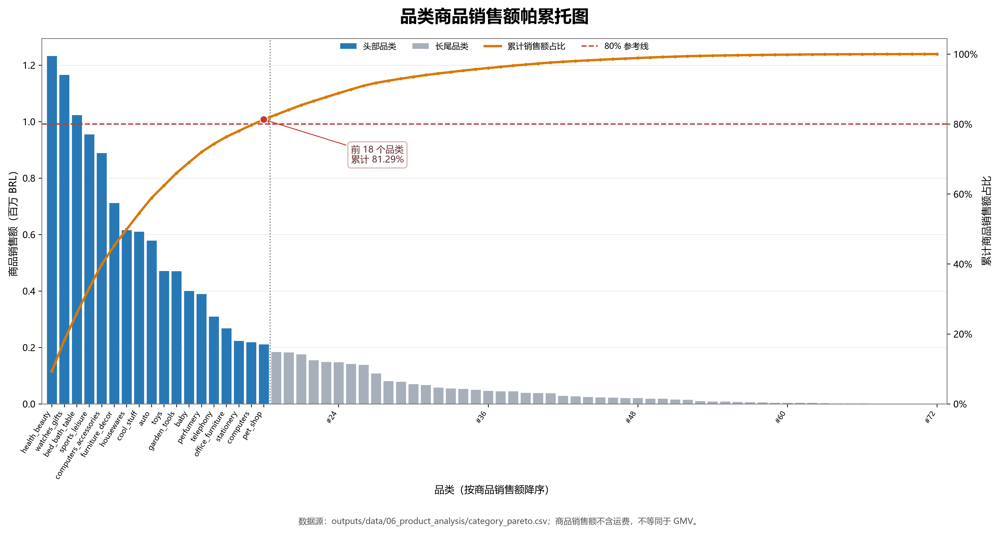
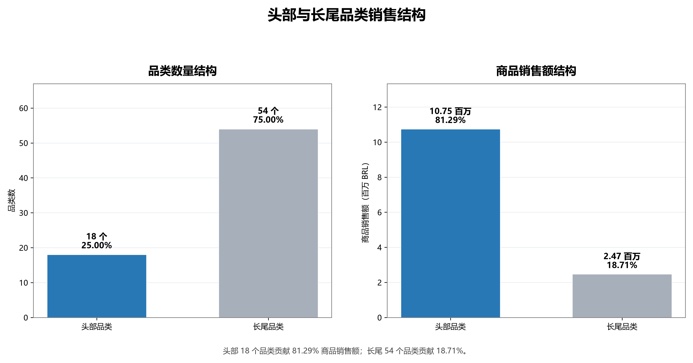
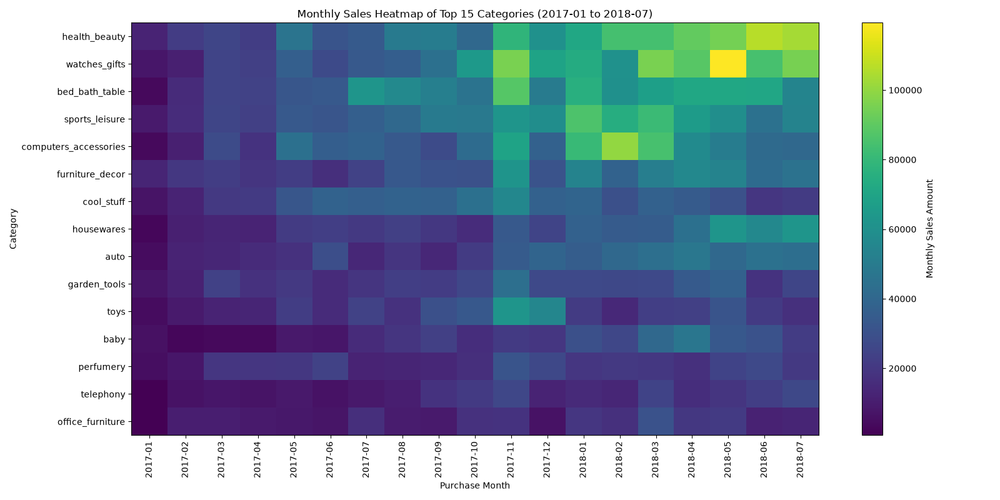
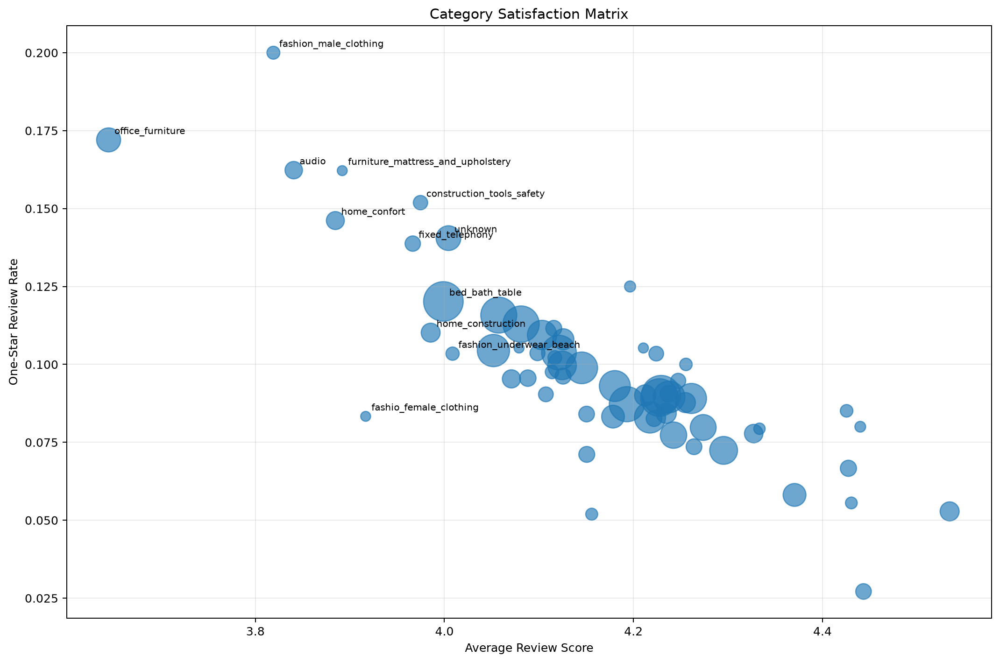

| 日期 | 修改人 | 版本号 | 备注 |
|---|---|---|---|
| 2026-08-13 | Codex | v1.0 | 按最新成员报告、SQL 与 CSV 重建阶段四综合报告 |

# 阶段四：商品品类结构分析最终报告

## 摘要

本报告整合品类销售集中度、增长趋势、满意度和关联规则四部分。所有正式结果仅使用 `order_status = 'delivered'` 的订单，按 `orders.order_purchase_timestamp` 归属时间。品类销售额统一指 `SUM(order_items.price)`，不含运费，不表述为 GMV；英文品类缺失或无法映射时归为 `unknown`，并保留在所有总体与占比分母中。

阶段四的主要结论是：

1. 72 个品类共实现商品销售额 13,221,498.11 BRL，其中前 18 个品类贡献 81.29%，销售结构明显集中，但并非严格的“20% 品类贡献 80%”。
2. 在 2017-01 至 2018-07 的统一增长窗口内，平台商品销售额 CMGR 为 12.06%。当前正式分类结果为明星 5 个、潜力 6 个、稳定 27 个、衰退 10 个、新兴 24 个。
3. 高销售规模不等同于高增长。`health_beauty`、`watches_gifts`、`bed_bath_table` 等头部品类属于稳定品类；`housewares`、`telephony`、`pet_shop` 等同时具有较高规模和高于平台 5 个百分点以上的 CMGR。
4. 63 个品类达到至少 30 个有效评分订单的正式比较门槛。`office_furniture` 平均评分最低且 1 星率较高；`bed_bath_table` 的文字差评样本量最大，适合进一步开展投诉主题拆解。
5. 商品级高 Lift 规则普遍 Support 很低；品类级仅 `home_confort → bed_bath_table` 一条规则达到正式阈值。因此现有数据只支持少量局部共购线索，不支持大规模稳定组合销售结论。

## 1. 数据来源与统一口径

### 1.1 公共数据层

本阶段复用以下公共层：

| 表 | 粒度 | 用途 |
|---|---|---|
| `category_item_base` | `order_id + order_item_id` | delivered 订单商品明细 |
| `category_order_base` | `order_id + category_name` | 去除同订单同品类重复后的订单—品类层 |
| `category_sales_base` | 一行一个品类 | 销售额、订单量、件数和销售排名 |
| `category_monthly_sales_base` | 一行一个月份—品类 | 月度增长、CMGR 与分类 |

总体销售、帕累托和增长分析不重新连接原始订单明细；满意度从 `category_order_base` 连接一单一条的代表评论；关联规则以全部 delivered 订单为购物篮分母。

### 1.2 指标边界

- 商品销售额：`SUM(order_items.price)`，不含 `freight_value`。
- 品类订单量：在 `order_id + category_name` 粒度计数，同订单同品类不重复。
- 品类名称：优先英文翻译，缺失或无法映射时为 `unknown`。
- 增长正式窗口：2017-01 至 2018-07；2016-09、2018-08 仅保留在公共层展示。
- 评论：一单多评论按回答时间、创建时间、评论 ID 降序稳定选择一条代表评论。
- 关联规则：单商品订单保留在 Support 分母，同订单同商品去重。

## 2. 品类规模与帕累托结构

### 2.1 总体规模

`category_sales_base.csv` 共 72 行、72 个非空且不重复品类，总商品销售额为 13,221,498.11 BRL。销售额最高的五个品类为：

| 排名 | 品类 | 商品销售额（BRL） | 销售额占比 |
|---:|---|---:|---:|
| 1 | `health_beauty` | 1,233,131.72 | 9.33% |
| 2 | `watches_gifts` | 1,166,176.98 | 8.82% |
| 3 | `bed_bath_table` | 1,023,434.76 | 7.74% |
| 4 | `sports_leisure` | 954,852.55 | 7.22% |
| 5 | `computers_accessories` | 888,724.61 | 6.72% |

`unknown` 位列第 21，商品销售额 175,967.21 BRL，占 1.33%；该部分未被排除。

### 2.2 80% 临界点

第 17 名 `computers` 的累计销售额占比为 79.6875%；加入第 18 名 `pet_shop` 后达到 81.2887%。因此跨过 80% 实际需要 18 个品类，占全部品类的 25.00%。

| 分类 | 品类数 | 品类数占比 | 商品销售额（BRL） | 销售额占比 |
|---|---:|---:|---:|---:|
| 头部 | 18 | 25.00% | 10,747,579.01 | 81.29% |
| 长尾 | 54 | 75.00% | 2,473,919.10 | 18.71% |
| 总体 | 72 | 100.00% | 13,221,498.11 | 100.00% |

该结果说明销售额向少数品类集中，但前 15 个品类仅贡献 76.34%，必须扩大到前 18 个品类才能达到 80%。因此只能说“方向上接近二八结构”，不能认定严格符合二八定律。

## 3. 品类增长与分类

### 3.1 增长口径

品类与平台 CMGR 均使用固定端点：

`CMGR = (2018-07 商品销售额 / 2017-01 商品销售额)^(1/18) - 1`

只有 2017-01 与 2018-07 均有销售额的品类能够计算有效 CMGR。平台期初商品销售额为 111,798.36 BRL，期末为 867,953.46 BRL，平台 CMGR 为 12.06%；有效品类 CMGR 的算术平均值为 12.18%。

### 3.2 最新正式分类

分类以当前 `category_classification.csv` 为准：

| 类型 | 品类数 | 占比 | 判断规则 |
|---|---:|---:|---|
| 明星品类 | 5 | 6.94% | 有效 CMGR；销售额高于中位数；CMGR > 平台 CMGR + 5 个百分点 |
| 潜力品类 | 6 | 8.33% | 有效 CMGR；销售额不高于中位数；CMGR > 平台 CMGR + 5 个百分点 |
| 稳定品类 | 27 | 37.50% | 有效 CMGR 且不低于 0，但未达到明星/潜力标准 |
| 衰退品类 | 10 | 13.89% | 有效 CMGR 小于 0，或 2018-07 已无销售记录 |
| 新兴品类 | 24 | 33.33% | 2017-01 无销售、2018-07 有销售，因缺少共同端点无法计算有效 CMGR |

当前成员专题报告中的“稳定 36、潜力 5、衰退 14、新兴 12”是旧版本文字，与最新 CSV 不一致，不作为本报告结论。

### 3.3 明星与潜力品类

| 类型 | 品类 |
|---|---|
| 明星 | `housewares`、`telephony`、`pet_shop`、`musical_instruments`、`agro_industry_and_commerce` |
| 潜力 | `kitchen_dining_laundry_garden_furniture`、`books_general_interest`、`food`、`fashion_shoes`、`furniture_bedroom`、`music` |

明星品类中，`agro_industry_and_commerce` CMGR 最高，为 29.23%；`telephony` 为 21.85%，`pet_shop` 为 19.37%。潜力品类规模较小，CMGR 较高，但小基数可能放大增速，因此适合作为后续验证对象，而不是直接认定为确定增长机会。

头部销售品类多属于稳定品类。例如 `health_beauty` CMGR 为 12.53%，`watches_gifts` 为 14.68%，`bed_bath_table` 为 15.93%，均为正增长，但没有超过 17.06%的高增长门槛。这表明规模和增速必须分别判断。

## 4. 品类满意度与差评主题

### 4.1 样本规则

72 个品类中，63 个拥有至少 30 个有效评分订单，进入正式比较；9 个品类标记为 `small_sample`。一张多品类订单的代表评论会进入该订单涉及的每个品类，因此品类评论订单数允许重叠，不能跨品类简单相加回算平台评论订单数。

### 4.2 重点结果

| 品类 | 有效评分订单 | 平均评分 | 1 星率 | 1 星文字评论订单 |
|---|---:|---:|---:|---:|
| `office_furniture` | 1,244 | 3.64 | 17.20% | 170 |
| `fashion_male_clothing` | 105 | 3.82 | 20.00% | 18 |
| `audio` | 345 | 3.84 | 16.23% | 39 |
| `home_confort` | 390 | 3.88 | 14.62% | 49 |
| `bed_bath_table` | 9,177 | 4.00 | 12.02% | 860 |

`office_furniture` 同时具有较低平均评分、较高 1 星率和较充足文字样本，是优先复核对象。`fashion_male_clothing` 的 1 星率更高，但仅 105 个评分订单，解释时必须考虑样本规模。`bed_bath_table` 平均评分并非最低，却拥有 860 条 1 星文字评论订单，适合进一步进行投诉主题分类。

关键词中频繁出现与商品、收货和交付等待相关的葡萄牙语词语，但词频只说明评论中经常讨论这些主题，不能证明它们造成了差评。

## 5. 商品与品类关联规则

### 5.1 购物篮与阈值

- Support 分母：全部 96,478 个 delivered 订单；
- 单商品订单：93,281 个；多商品订单：3,197 个；
- 筛选标准：共现订单数不少于 5、`confidence >= 0.10`、`lift > 1`。

### 5.2 商品级结果

共有 23 条商品级方向性规则达到阈值，CSV 保留前 20 条。排名靠前的组合 Lift 可达数千，但共现订单通常只有 5—6 单，Support 约为 0.00005—0.00006。这是稀有商品在小样本下形成的局部高相对共现，不等于高覆盖率或高商业价值。

### 5.3 品类级结果

仅一条品类级规则达到正式阈值：

`home_confort → bed_bath_table`

- 共现订单：43；
- Support：0.000446；
- Confidence：10.97%；
- Lift：1.1414。

该规则只表示轻度正向共购迹象。Support 很低且 Lift 仅略高于 1，不足以直接支持规模化组合推荐。

## 6. 综合业务判断

1. 平台品类销售集中但仍依赖较宽的头部组合，经营监控不应只关注前 10 或前 15 个品类。
2. `health_beauty`、`watches_gifts`、`bed_bath_table` 等稳定头部品类构成销售基本盘；明星品类提供更强增长信号，但需要结合绝对规模判断投入优先级。
3. 新兴品类多达 24 个，表示许多品类缺少固定期初端点，不能用 CMGR 与成熟品类直接比较。应继续观察其连续销售规模，而不是把“无法计算 CMGR”误写成零增长。
4. `office_furniture` 兼具销售规模、满意度压力与文字评论样本，适合优先开展订单、卖家、配送和商品问题的联合复核。
5. 当前关联规则覆盖率有限，推荐和组合销售需要时间外验证或在线实验，不能仅凭 Lift 排名投放。

## 7. 局限性

- 商品销售额不等于 GMV，也不包含运费。
- 数据没有商品成本、毛利、营销费用、退货退款和推荐曝光，不能评价利润或策略收益。
- CMGR 只比较两个固定端点，可能受端点波动影响；新兴和部分衰退品类因端点缺失无法得到有效 CMGR。
- 品类评论存在多品类订单重复归属，关键词属于描述性文本统计。
- 关联规则反映历史共现，不代表因果关系或未来效果。

## 8. 结果追溯

| 模块 | 专题报告 | SQL/代码 | 主要 CSV |
|---|---|---|---|
| 帕累托 | [01_category_pareto.md](01_category_pareto.md) | `01_category_sales_pareto.sql`、`category_pareto_analysis.py` | `category_pareto.csv` |
| 增长 | [02_category_growth.md](02_category_growth.md) | `02_category_growth.sql`、`category_sales_heatmap.py` | `category_monthly_growth.csv`、`category_and_platform_cmgr.csv`、`category_classification.csv` |
| 满意度 | [03_category_satisfaction.md](03_category_satisfaction.md) | `04_category_satisfaction.sql`、评论关键词及绘图脚本 | `category_satisfaction.csv`、`category_negative_keywords.csv` |
| 关联规则 | [04_product_association.md](04_product_association.md) | `product_association_rules.py` | `product_association_top20.csv`、`category_association_top20.csv` |

本报告中的关键数字已按当前 CSV 回算。专题报告与 CSV 冲突时，以统一口径、当前 SQL 逻辑和当前正式 CSV 为准。
